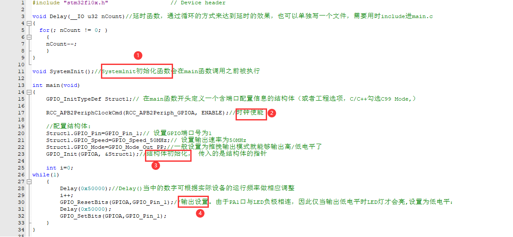
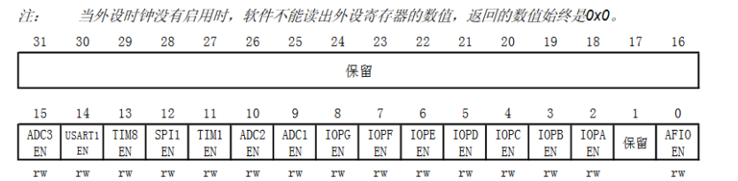
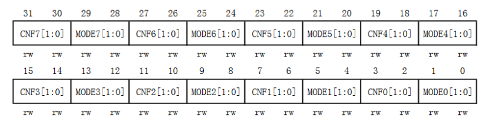
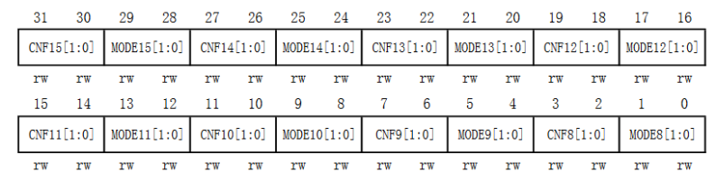
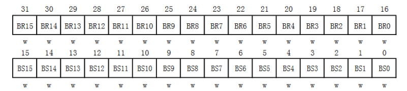
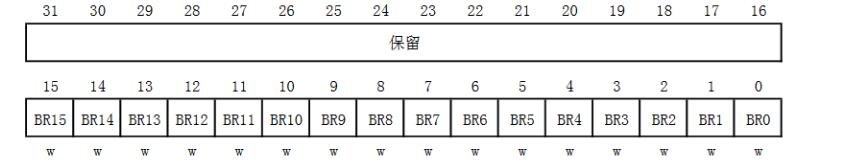

## STM32基本GPIO操作：

## 一、点灯（库函数+寄存器）https://codeleading.com/article/42023263706/

### 1.库函数版本

```c
#include "stm32f10x.h"                  // Device header

void Delay(__IO u32 nCount)//延时函数，通过循环的方式来达到延时的效果，也可以单独写一个文件，需要用时                               include进main.c
{
  for(; nCount != 0; )
	{
	nCount--;
	}
} 

void SystemInit();//Systemlnit初始化函数会在main函数调用之前被执行

int main(void)
{
	GPIO_InitTypeDef Struct1;// 在main函数开头定义一个含端口配置信息的结构体（或者工程选项，C/C++勾选C99 Mode,） 
	
	RCC_APB2PeriphClockCmd(RCC_APB2Periph_GPIOA, ENABLE);//时钟使能
	
	//配置结构体:
	Struct1.GPIO_Pin=GPIO_Pin_1;// 设置GPIO端口号为1
    Struct1.GPIO_Speed=GPIO_Speed_50MHz;// 设置输出速率为50MHz
    Struct1.GPIO_Mode=GPIO_Mode_Out_PP;//一般设置为推挽输出模式就能够输出高/低电平了
	GPIO_Init(GPIOA, &Struct1);//结构体初始化， 传入的是结构体的指针
	
	int i=0;
while(1)
	{
		Delay(0x50000);//Delay()当中的数字可根据实际设备的运行频率做相应调整
		i++;
		GPIO_ResetBits(GPIOA,GPIO_Pin_1);//输出设置。由于PA1口与LED负极相连，因此仅当输出低电平时LED灯才会亮,设置为低电平：
		Delay(0x50000);
		GPIO_SetBits(GPIOA,GPIO_Pin_1);
	}
}

```



**tips：初始化PBA1端口启动同组的多个端口：**
例如要同时启用PB5,PB6端口，第一种方案是在之前的代码之后添加以下内容

```
GPIO_InitStructure.GPIO_Pin = GPIO_Pin_6;
GPIO_Init(GPIOB, &GPIO_InitStructure);
```

因为PB5、PB6同属于GPIOB组，GPIOB的时钟已经使能且PB6端口的其他配置和PB5端口相同，因此改变结构体的端口号之后再次执行初始化函数即可

第二种方案是将之前代码当中的

```
Struct.GPIO_Pin = GPIO_Pin_5; 
```

改为

```
Struct.GPIO_Pin = GPIO_Pin_5 | GPIO_Pin_6; 
```

因为GPIO_Pin_0 ~ GPIO_Pin_15分别对应二进制数1、10、100、……，因此使用位运算当中的或运算即可将两个参数叠加起来

同理，如果想同时使能PORTA、PORTB、PORTC时钟，则可将

```
RCC_APB2PeriphClockCmd(RCC_APB2Periph_GPIOB, ENABLE);  
```

改为

```
RCC_APB2PeriphClockCmd(RCC_APB2Periph_GPIOA | RCC_APB2Periph_GPIOB |RCC_APB2Periph_GPIOC, ENABLE);  
```

**GPIO_WriteBit与GPIO_SetBits的区别。**
GPIO_WriteBit是对一个IO口进行写操作，可以是写0或者写1；而GPIO_SetBits可以对多个IO口同时进行置位1。
例：
对单个IO口置0或1：GPIO_WriteBit(GPIOA,GPIO_Pin_8 , 0);
同时对多个IO口置1：GPIO_SetBits(GPIOD,GPIO_Pin_0 | GPIO_Pin_5 | GPIO_Pin_6);

### 2、寄存器版本（建议和库函数版本对比异同）

这一部分需要对C语言的位运算有一定的了解

#### 0.寄存器

以下是需要用到的寄存器，通过查询STM32中文参考手册7.3和8.2可获得更加详细的信息。

RCC寄存器：
APB2外设时钟使能寄存器(RCC->APB2ENR)

GPIO寄存器：
端口配置低寄存器(GPIOx->CRL)（x=A…E）
端口输出数据寄存器(GPIOx->ODR)（x=A…E）
端口位设置/清除寄存器(GPIOx->BSRR)（x=A…E）
端口位清除寄存器(GPIOx->BRR)（x=A…E）

#### 1.初始化

以下是初始化PB5端口的代码

```
// PORTB时钟使能
RCC->APB2ENR |= 1<<3;      //将寄存器APB2ENR的第3位（与PORTB对应）设为1

// 初始化
GPIOB->CRL &= 0XFF0FFFFF;  //清空寄存器CRL第20~23位（Pin5对应的参数）
GPIOB->CRL |= 0X00300000;  //将寄存器CRL第20~23位设为0011
123456
```

初始化流程：
时钟使能 → 直接通过配置寄存器来初始化端口

关于APB2ENR寄存器：
APB2ENR寄存器的各位描述如下：

由图可知，若需要使能PORTC时钟，则需要以下代码

```
RCC->APB2ENR |= 1<<4;
1
```

与库函数版本类似，若需要同时使能PORTA、PORTB、PORTC时钟，则需要以下代码

```
RCC->APB2ENR |= (1<<3) | (1<<4) | (1<<5);
1
```

关于CRL寄存器：
CRL寄存器的各位描述如下：

当中的每4个位对应1个输出端口，查阅资料可得推挽输出对应的配置位(CNFx)为00，50MHz输出速率对应的模式位(MODEx)为11
4个位(bit)刚好与1个16进制数相对应（2^4 = 16^1 = 16),因此一个16进制数0 ~ F刚好对应了一个GPIO端口的配置。二进制数0011对应的16进制数为0x3，因此上面的初始化代码可将寄存器的第20 ~ 23位设为0011

同理，若需要将PC2口初始化为推挽输出+50MHz输出速率，则需要以下代码

```
GPIOC->CRL &= 0XFFFFF0FF;  //清空CRL寄存器第8~11位（Pin2对应的参数）
GPIOC->CRL |= 0X00000300;  //将CRL寄存器第8~11位设为0011
12
```

设置Pin0 ~ Pin7时用的是CRL寄存器，设置Pin8 ~ Pin15时用的是CRH寄存器，CRH寄存器的各位描述如下，具体设置方法和CRL寄存器类似


#### 2.使用（多种方案）

##### 2.1 传统操作

###### 2.1.1 通过ODR寄存器操作(麻烦)

ODR名为端口输出数据寄存器，向其0 ~ 16位写入1则对应端口为高电位，反之为低电位
这种特性意味着每次设置ODR寄存器需要给出0号端口 ~ 15号端口的高低电位
由于看开发手册没有看全，首先想到的是这种操作方法

设置为低电平：

```
GPIOB->ODR &= 0xffffffff-(1<<5); //将第5位(bit)清空
GPIOB->ODR |= 0<<5;              //将第5位(bit)设置为0
12
```

设置为高电平：

```
GPIOB->ODR &= 0xffffffff-(1<<5); //将第5位(bit)清空
GPIOB->ODR |= 1<<5;              //将第5位(bit)设置为1
12
```

###### 2.1.2 通过BSRR/BRR寄存器操作(简单)

BSRR名为端口位设置/清除寄存器，向其0 ~ 16位(bit)写入1则ODR对应位变为1（对应端口为高电位），写入0则不变

BRR名为端口位清除寄存器，向其0 ~ 16位写入1则ODR对应位变为0（对应端口为低电位)，写入0则不变

后期发现了这种更方便的操作方法

设置为低电平：

```
GPIOB->BRR &= 1<<5; //将第5位设置为0
1
```

设置为高电平：

```
GPIOB->BSRR &= 1<<5; //将第5位设置为1
1
```

不使用BRR寄存器，仅使用BSRR寄存器来将ODR对应位变为0/1也是可以的，具体方法可参考STM32中文参考手册8.2.5

##### 2.2 位带操作

个人理解是通过访问一个32位长度的地址区间（类似于直接操作一个unsigned int）来达到访问1个位的效果，各种资料上说这种操作更优越
具体实现还不会，不过开发板资料中有现成的头文件可供使用

头文件中的代码如下：

```
#define BITBAND(addr, bitnum) ((addr & 0xF0000000)+0x2000000+((addr &0xFFFFF)<<5)+(bitnum<<2)) 
#define MEM_ADDR(addr)  *((volatile unsigned long  *)(addr)) 
#define BIT_ADDR(addr, bitnum)   MEM_ADDR(BITBAND(addr, bitnum)) 

#define GPIOA_ODR_Addr    (GPIOA_BASE+12) //0x4001080C 
#define GPIOB_ODR_Addr    (GPIOB_BASE+12) //0x40010C0C 
#define GPIOC_ODR_Addr    (GPIOC_BASE+12) //0x4001100C 
#define GPIOD_ODR_Addr    (GPIOD_BASE+12) //0x4001140C 
#define GPIOE_ODR_Addr    (GPIOE_BASE+12) //0x4001180C 
#define GPIOF_ODR_Addr    (GPIOF_BASE+12) //0x40011A0C    
#define GPIOG_ODR_Addr    (GPIOG_BASE+12) //0x40011E0C    

#define GPIOA_IDR_Addr    (GPIOA_BASE+8) //0x40010808 
#define GPIOB_IDR_Addr    (GPIOB_BASE+8) //0x40010C08 
#define GPIOC_IDR_Addr    (GPIOC_BASE+8) //0x40011008 
#define GPIOD_IDR_Addr    (GPIOD_BASE+8) //0x40011408 
#define GPIOE_IDR_Addr    (GPIOE_BASE+8) //0x40011808 
#define GPIOF_IDR_Addr    (GPIOF_BASE+8) //0x40011A08 
#define GPIOG_IDR_Addr    (GPIOG_BASE+8) //0x40011E08 

#define PAout(n)   BIT_ADDR(GPIOA_ODR_Addr,n)  
#define PAin(n)    BIT_ADDR(GPIOA_IDR_Addr,n)  

#define PBout(n)   BIT_ADDR(GPIOB_ODR_Addr,n)  
#define PBin(n)    BIT_ADDR(GPIOB_IDR_Addr,n)  

#define PCout(n)   BIT_ADDR(GPIOC_ODR_Addr,n)  
#define PCin(n)    BIT_ADDR(GPIOC_IDR_Addr,n)  

#define PDout(n)   BIT_ADDR(GPIOD_ODR_Addr,n)  
#define PDin(n)    BIT_ADDR(GPIOD_IDR_Addr,n)   

#define PEout(n)   BIT_ADDR(GPIOE_ODR_Addr,n)   
#define PEin(n)    BIT_ADDR(GPIOE_IDR_Addr,n)  

#define PFout(n)   BIT_ADDR(GPIOF_ODR_Addr,n)  
#define PFin(n)    BIT_ADDR(GPIOF_IDR_Addr,n)  

#define PGout(n)   BIT_ADDR(GPIOG_ODR_Addr,n)  
#define PGin(n)    BIT_ADDR(GPIOG_IDR_Addr,n)  
12345678910111213141516171819202122232425262728293031323334353637383940
```

include该头文件后即可使用位带操作

设置为低电平：

```
PBout(5) = 0;
1
```

设置为高电平：

```
PBout(5) = 1;
1
```

#### 3.闪灯例程

代码如下：

```
void Delay(unsigned int count)
{
  unsigned int i = 0;
  for (; i < count; i++)
    ;
}
int main(void)
{
  RCC->APB2ENR |= 1<<3;

  GPIOB->CRL &= 0XFF0FFFFF;
  GPIOB->CRL |= 0X00300000;  

  while (1)
  {
    GPIOB->BSRR = 1<<5;
	Delay(10000000);
		
    GPIOB->BRR = 1<<5;
	Delay(10000000);
  }
}
12345678910111213141516171819202122
```

Delay()当中的数字可根据实际设备的运行频率做相应调整