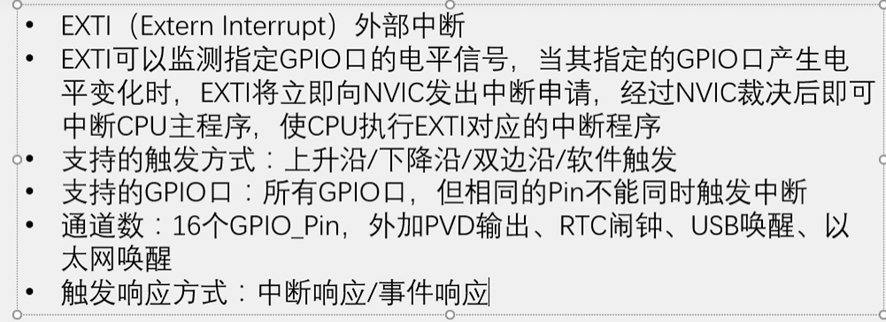

## 中断向量表

### 一、定义与特点

#### 定义：

中断向量表(interrupt vector table)包含中断服务程序地址的特定内存区域，这些服务程序是处理外部硬件中断请求的代码。

#### 特点：

这些中断服务程序(函数)在中断向量表中的位置是由半导体厂商定好的，

#### 中断向量表的使用过程：

​			**硬件层面**：对于i.MX6ULL处理器，当某个中断被触发以后就会自动跳转到中断向量表中，中断向量表的地址和大小是固定的，并且不允许被修改

​			**软件层面**：由中断向量表再跳转到对应的中断服务程序(函数)入口地址处，这个地址是**每次程序编译后**随机生成的

对于stm32,中断向量表中包含了256个中断向量项，每个向量项包含4个字节，分别存放中断处理程序的地址。当系统发生中断时，CPU会根据中断号找到对应的中断向量项，并读取其中存放的中断处理程序地址，然后跳转到该地址执行中断处理操作。

#### 中断向量表的作用

​		在 CPU 接收到外部中断请求时,它会先查询中断向量表,以查找到相应的中断服务程序地址。首先会保护现场，然后,CPU 会将控制转移到该地址,以执行相应的中断服务。完成中断服务程序后,控制会恢复到中断发生前的程序流程。

## nvic（中断控制器）： 内核外设(所以不用开启时钟，rcc管的都是内核外的外设)，CPU的小助手，管理中断优先级

### 基本结构：

👆n表示一个外设可以同时占用多个中断，但是nvic只有一个输出口,根据中断优先级来发送信息给CPU

**EXTI的基本结构图**

##### EXTI简介

软件触发即程序代码触发，与之对应的是硬件触发

中断响应是正常的流程，引脚电平变化触发中断

事件响应不会触发中断，而是触发别的外设操作，属于外设之间的联合工作

内部终端指内核内部触发中断，对应外部中断指内核外部触发的中断

**AFIO作用:**

AFIO主要用于引脚复用功能的选择和重定义。在stm32中，AFIO主要完成两个任务：复用功能重映射、中断引脚选择

下图是AFIO选择中断引脚的结构图，解释了相同pin不能同时触发中断的原因：是因为它们使用同一条中断线：

### nvic优先级分组：

值越小，对应优先级越高，0是最高优先级

由EXTI的基本结构图可知，从GPIO到NVIC这一路中出现的外设模块都配置好，就可以成功配置外部中断了。以stm32c8t6为例
**第一步：配置RCC，将涉及到的外设的时钟都打开**
		主要是三个开启时钟的函数，RCC_APB2PeriphClockCmd(APB2的外设时钟控制)，用于开启GPIOA和AFIO的时钟（GPIOA、AFIO都是总线APB2的外设）
		

​	接着是开启EXTI和NVIC（是内核的外设，不需要开启时钟，RCC管的是内核外的外设）两个外设的时钟，它们的时钟是一直打开的，不需要再开启

**第二步：配置GPIO，选择端口为输入模式**
			

**第三步:配置AFIO，**调用函数 GPIO_EXTILineConfig 就可以完成AFIO外部中断引脚选择配置，选择我们要用的这一路GPIO，连接到后面的EXTI（AFIO没有专门的库函数文件，它的库函数和GPIO在一个文件中）。
		 
**第四步：配置EXTI**，选择边沿触发方式，比如上升沿、下降沿或双边沿；还有选择触发响应方式，中断响应或事件响应（一般都是中断响应)

**第五步：配置NVIC，给中断选择合适的优先级**
最后，通过NVIC，外部中断信号就能进入CPU了。CPU接收到中断信号后，跳转到中断函数里执行中断程序。由图可知，这一过程中涉及到的外设有RCC、GPIO、AFIO、EXTI、NVIC.

综上，外部中断的信号从GPIO到AFIO,再到EXTI，再到NVIC,最终通到CPU，这样才能让CPU由主程序跳转到中断程序执行，这里需要写一个中断函数：

