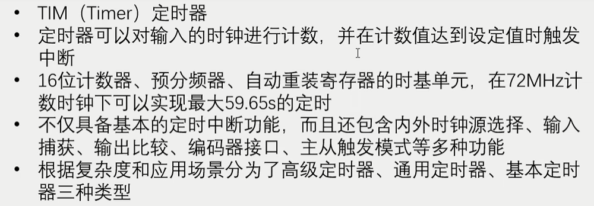
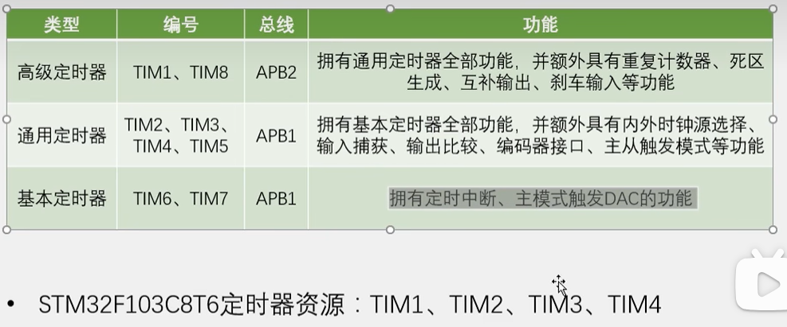
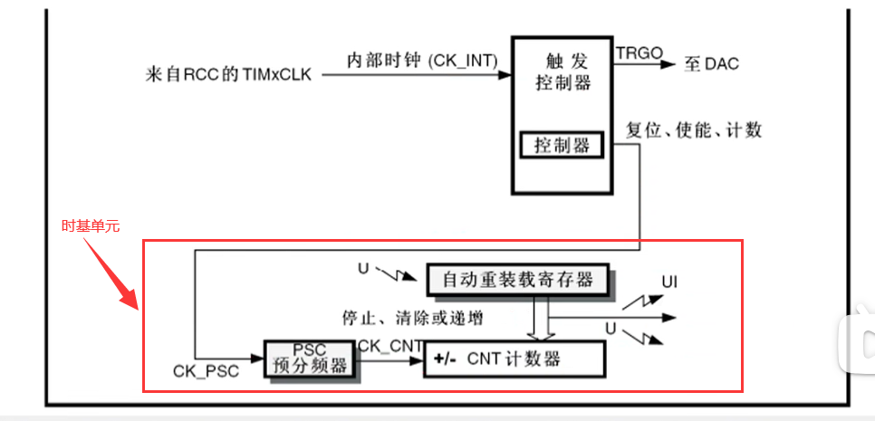
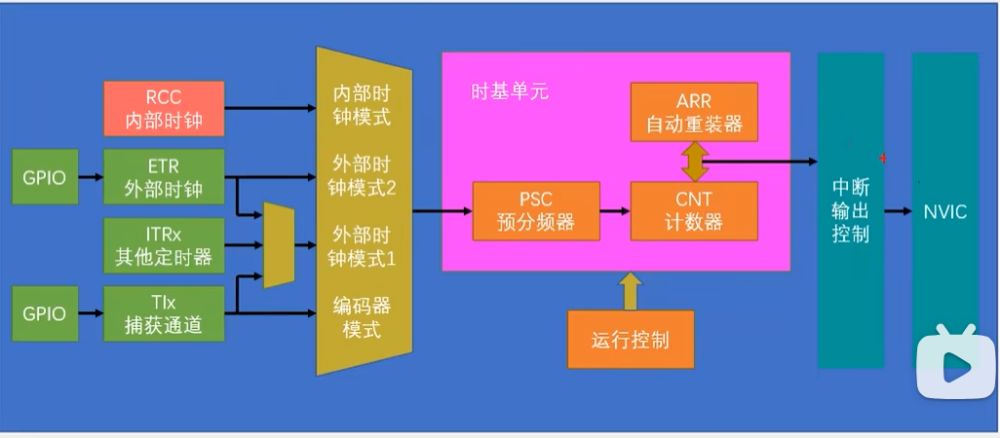
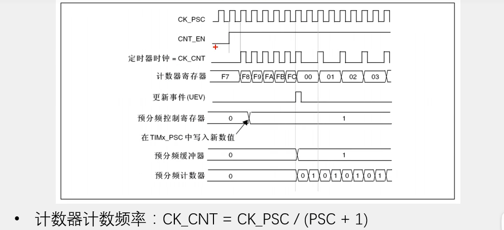
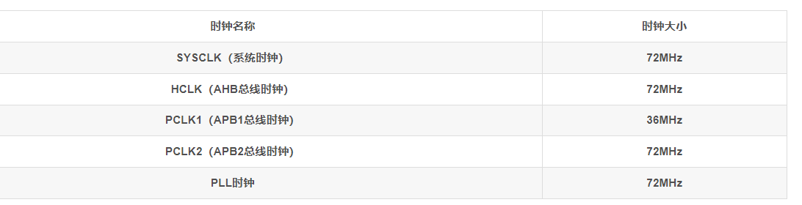

[TOC]


# TIM定时中断

(内含：1.TIM简介+2.定时器类型+3.基本定时器+4.通用定时器+5.高级定时器+6.定时中断基本结构+7.预分频器时序+8.计数器时序+...)

# 定时器简介：



解释： 预分频器可以对计数器的时钟进行分频，让这个记数更加灵活。计数器是执行计数定时的寄存器，每来一个时钟，计数器加1。自动重装寄存器就是记数的目标值，即想要计多少个时钟申请中断。**时基单元**由这三部分构成，也是定时器最重要的部分。计数器，预分频器，自动重装寄存器均是16位的，当它们都被设置为最大(2的16次方，即65536时），定时器最大定时时间为59.65s。(72M即72* 10^6)
即中断频率f=72M/65536/65536.....T=1/f=59.65s。STM32可级联，即一个定时器输出当另一个定时器输入(原理图在后面)。此时为59.65x65536x65536，约为8000多年。当然，还可以再级联，为59.65秒x65536X65536x65536x65536，约为34万亿年。

## 定时器类型：



主模式触发DAC的功能：它能让内部的硬件在不受程序控制下实现自动运行


## 基本定时器框图：



工作流程：

​		由于基本定时器只能选择内部时钟，内部时钟的来源是RCC_TIMxCLK，这里的频率值一般都是系统的主频72MHZ,所以通向时基单元的计数基准频率就是72M。再看时基单元，如果预分频器写1，那就是2分频，输出频率=输入频率/2=36MHZ.（预分频器的值和实际的分频系数相差1，即**实际分频系数=预分频器的值＋1**，这里的预分频器是16位的，所以最大值可以写65535，也就是65536分频）
计数器自增计数（向上计数模式），当计数值计到自动重装值时，计数值清零产生**更新中断**（向上的箭头）通往NVIC，再配置好NVIC的定时器通道，此时定时器的更新这段你就能够得到cpu的响应了。同时产生更新事件（向下的箭头），它不会触发中断，但可以触发内部其他电路的工作。

## 通用定时器框图：

.JPG)在通用和高级定时器中，计数器支持向上计数模式、向下计数模式和中央对齐模式
对于时钟输入而言，最常用的还是内部72MHZ的时钟，如果要选外部时钟，首选ETR引脚外部时钟模式2的输入。

#### 第一部分：定时器的时钟来源

时钟来源有很多：
CK_INT、TIMx_ETR、ITR0、ITR1、ITR2、ITR3、TI1F_ED、TI1FP1、TI2FP2这9个，可以分下类；

1. CK_INT，就是定时器外设的时钟，比如72MHz，属于内部时钟

2. TIMx_ETR，就是定时器所对应的外部输入，这个外部输入信号（比如来自于另一个微控制器）经过相位检测、边缘检测和分频之后的信号就是ETRP，ETRP经过输入滤波之后又分成两路，一路直接用于时钟计数（跟CK_INT一样）这就是外部时钟模式2（ETR2）；

3. 第二种外部输入是TRGI当成外部时钟来输入，叫作“外部时钟模式1”（ETR1，不常用），它的输入可以是ETR引脚、其他定时器、CH1引脚的边沿、CH1引脚和CH2引脚。

ITR0、ITR1、ITR2、ITR3，这几个的信号之后都是传给从模式控制器，就是两个定时器串联着使用，前面的那个定时器可以看成后面那个定时器的预分频器。

**ETR外部时钟和输入捕获的不同**

在STM32微控制器（或类似的高级微控制器）中，ETR（外部触发输入，External Trigger Input）时钟和输入捕获功能虽然都涉及外部信号的处理，但它们的用途和工作方式有所不同：

1. **ETR外部时钟**：
   - ETR通常是定时器的一个特性，用于从外部源（如另一个微控制器的输出或传感器）接收时钟信号。
   - ETR功能允许定时器以外部时钟源为基准来计数，而非内部时钟源。这意味着定时器的计数速率和周期可以直接由外部信号控制。
   - ETR输入可以用于同步操作，比如在多个微控制器之间同步时间或事件。
2. **输入捕获**：
   - 输入捕获是定时器的另一种模式，用于捕获并记录外部事件发生的确切时间点（例如，一个脉冲的上升沿或下降沿）。
   - 当外部事件发生时（比如一个GPIO引脚的状态变化），输入捕获功能会记录下当前定时器的计数值。这允许微控制器测量两个事件之间的时间间隔，或者确定具体的事件发生时间。
   - 输入捕获通常用于测量频率、脉宽和时间间隔等，是实现编码器读取、频率测量等功能的关键。

简而言之，ETR功能使定时器能够以外部时钟源为计数基准，而输入捕获功能则用于测量外部事件的发生时间。这两个功能虽然都涉及外部信号的接收，但ETR更多关注于定时器的计数同步，而输入捕获则关注于精确测量外部事件的时间点。

#### 第二部分：时基单元

#### 第三部分：输入捕获

TI1FP1 是来自于通道TI1，经过输入滤波和边沿检测后送给捕获比较通道IC1；
TI1FP2是来自于通道TI1，经过输入滤波和边沿检测后送给捕获比较通道IC2；

TI1FP1和TI1FP2这两个信号的特性是一模一样的，都是通道1的信号经过滤波和边沿检测之后产生的信号，只是TI1FP1是送给捕获比较通道IC1，TI1FP2是送给捕获比较通道IC2。

以下同理。

这一块的意思大概是这样的：

通用定时器都有4个通道，CH1、CH2、CH3、CH4，分别都有外部的引脚对应；
外部的信号进入通道后，进行滤波的边沿检测，并生成两路一模一样的信号TIxFPx;
CH1和CH2可以看成一伙的，它们生成的两路信号是，你给我一个，我给你一个；
CH3和CH4也可以看成一伙的，它们生成的两路信号也是，你给一个我，我给一个你；
最后这些信号都是经过分频之后给捕获比较寄存器。
所谓捕获比较寄存器，对输入信号来说就是捕获寄存器，对输出信号来说就是比较寄存器。

#### 第四部分：输出比较

通用定时器都有4个通道，CH1、CH2、CH3、CH4，这4个通道既可以是输入，也可以是输出；
用作输入的话就是输入捕获通道，用作输出的话就是输出比较通道。东西还是同一个东西，用法不同，名字就不同了。

## 高级定时器框图：

高级定时器申请中断的地方多了一个重复次数计数器，因此可以每隔多个计数周期才发生一次更新事件和更新中断（原来的结构是每个计数周期完成后都会发生中断），相当于对输出的更新信号又做了一次分频
死区生成电路DTG：右边的输出引脚由原来的一个变成了两个互补的输出，可以输出两个互补的PWM波，这些电路是为了驱动三相无刷电机的,输出pwm引脚的前三路变为了互补的输出，而第四路没什么变化，因为三相电机只需要三路就可以了。另外为了防止互补输出的PWM驱动桥臂时，在开关切换的瞬间，由于器件的不理想，造成短暂的直通现象，所以前面加上了死区生成电路，在开关切换的瞬间，产生移动时长的死区，让桥臂的上下管全都关断，防止直通现象
刹车输入的功能：为电机驱动提供安全保障，如果外部引脚BKIN（Break In）产生了刹车信号，或者内部时钟失效，产生了故障，控制电路就会自动切断电机的输出，防止意外的发生

# 定时中断基本结构：



时钟树上的内外时钟是相对而言的，整个时钟树分配出来的时钟都作为单片机的内部时钟，给各个外设用。

但是由GPIO的pin角输入的时钟作为单片机的外部时钟。

## 时序图

当预分频的参数从1变到2时，计数器的时序图：



计数器时序图：

/(ARR+1)

这个公式中的 "+1" 是由于定时器的计数方式决定的。在许多微控制器的定时器中，计数是从0开始的。这意味着：

- 预分频器将时钟频率分频的值是 `PSC + 1`。比如，如果PSC设为0，则分频后的频率不变（即分频系数为1）；如果PSC设为1，则分频后的频率是原始时钟频率的一半，以此类推。
- 类似地，定时器计数的最大值是 `ARR + 1`。如果ARR设为999，那么定时器的计数范围是0到999，总共1000个计数值。

因此，这些 "+1" 是确保计算时包含了从0开始的整个计数范围。

影子寄存器（也叫预分频缓冲器）的作用：让值的变化和更新事件同步发生，防止在运行途中更改造成错误


# 时钟树（RCC）：

时钟树是stm32中用来产生和配置时钟，并且把配置好的时钟发送到各个外设的系统。**时钟是所有外设的基础，所以时钟也是最先需要配置的东西。**程序中主函数之前还会执行一个systeminit的函数，这个函数就是用来配置时钟树的。**rcc的时钟来源分为两部分:1.内部的rc振荡器、2.外部的晶振HSE**


#### 图中名词释义：

```
PLLXTPRE是一个分频器，它可以选择HSE时钟的一分频或二分频作为PLL的输入时钟源；
PLLSRC是一个选择器，它可以选择HSI时钟的二分频或HSE时钟（经过PLLXTPRE分频）作为PLL的输入时钟源；
PLLMUL是一个倍频器，它可以将PLL的输入时钟源进行2~16倍的倍频，得到PLL的输出时钟源；
prescalear：预分频。
CSS：时钟安全系统（Clock Security System，CSS）负责切换时钟，可以监测外部时钟的运行状态，一旦外部时钟失效，它就会自动把外部时钟切换回内部时钟。从而保证系统时钟的正常工作，防止系统卡死造成事故。

STM32 有5个时钟源：HSI、HSE、LSI、LSE、PLL。从时钟频率来分可以分成高速时钟源和低速时钟源，在这5个中HSI、HSE和PLL是高速时钟源，LSI和LSE是低速时钟源。从时钟来源来分可以分成外部时钟源和内部时钟源。外部时钟源就是从外部通过接晶振的方式获取时钟源。其中，HSE和LSE是外部时钟源，其他的是内部时钟源。
HSI（High Speed Internal）是高速内部时钟，RC振荡器，频率为8MHz，精度不高；
HSE（High Speed External）是高速外部时钟，可接石英/陶瓷谐振器，或者接外部时钟源，频率范围为4MHz~16MHz；
LSI（Low Speed Internal）是低速内部时钟，RC振荡器，频率为40kHz，提供低功耗时钟。独立看门狗的时钟源只能是LSI，同时LSI还可以做PTC的时钟源；
LSE（Low Speed External）是低速外部时钟，接频率为32.768kHz的石英晶体。这个主要是RTC的时钟源。
PLL为锁相环倍频输出，其时钟输入源可选择为HSI/2、HSE或者HSE/2。倍频可选择为2~16倍，但是其输出频率最大不得超过72MHz。

```

#### ST配置时钟的流程：

首先启动内部时钟，选择内部八兆赫兹为系统时钟，暂时以内部八兆赫兹的时钟运行，然后再启动外部时钟，配置外部时钟，进入**PLL（锁相环）倍频器**（用于将输入的时钟信号进行倍频，以提高系统时钟的频率。PLL的输入时钟源可以是HSI/2或者HSE，倍频系数可以是2~16之间的整数）。PLL的输出时钟可以作为系统时钟或者提供给USB预分频器或者MCO，倍频八兆赫兹，倍频九倍，得到72兆赫兹，等到锁相环输出稳定后，选择锁相环输出为系统时钟，这样就把系统时钟由八兆赫兹切换为了72兆赫兹。
在systeminit的函数里，时钟树从中间画一个界线，左边的都是时钟的产生电路，右边的都是时钟的分配电路，中间的这个system clock就是系统时钟72兆赫兹，在时钟产生电路，有四个震荡源，分别是：1.内部的8MHZ高速RC振荡器；2.外部的4-16MHZ高速石英晶体振荡器，也就是晶振，一般都是接8MHZ；3.外部的32.768千赫兹低速晶振，这个一般是给RTC提供时钟的；4.最后是内部的40千赫兹低速RC振荡器，这个可以给看门狗提供时钟。上面的两个高速晶振，是用来提供系统时钟的，我们AHB、APB2、APB1的时钟都是来源于这两个高速晶振，这里内部和外部都有一个八兆赫兹的晶振，都是可以用的。**只不过是外部的石英振荡器比内部的RC振荡器更加稳定**，所以一般我们都用外部晶振，例如USB 对时钟要求比较高，所以 PLLCLK 只能是由 HSE 倍频得到，不能使用 HSI 倍频。但是如果系统很简单，而且不需要那么精确的时钟，那也是可以使用内部RC振荡器的。这样就可以省下外部晶振的电路了。

#### stm32 hal库HSE/HSI时钟配置

**HSE 高速外部时钟信号**

HSE 是高速的外部时钟信号，可以由有源晶振或者无源晶振提供，频率从 4-16MHZ 不等。当使用有源晶振时，时钟从 OSC_IN 引脚进入，OSC_OUT 引脚悬空，当选用无源晶振时，时钟从OSC_IN 和 OSC_OUT 进入，并且要配谐振电容。HSE 最常使用的就是 8M 的无源晶振。当确定 PLL 时钟来源的时候，HSE 可以不分频或者 2 分频，这个由时钟配置寄存器 CFGR 的位 17：PLLXTPRE 设置，我们设置为 HSE 不分频。

**PLL 时钟源**

PLL 时钟来源可以有两个，一个来自 HSE，另外一个是 HSI/2，具体用哪个由时钟配置寄存器CFGR 的位 16：PLLSRC 设置。HSI 是内部高速的时钟信号，频率为 8M，根据温度和环境的情况频率会有漂移，一般不作为 PLL 的时钟来源。这里我们选 HSE 作为 PLL 的时钟来源。

**PLL 时钟 ——PLLCLK**

通 过 设 置 PLL 的 倍 频 因 子， 可 以 对 PLL 的 时 钟 来 源 进 行 倍 频， 倍 频 因 子 可 以是:[2,3,4,5,6,7,8,9,10,11,12,13,14,15,16]，具体设置成多少，由时钟配置寄存器 CFGR 的位21-18：PLLMUL[3:0] 设置。我们这里设置为 9 倍频，因为上一步我们设置 PLL 的时钟来源为HSE=8M，所以经过 PLL 倍频之后的 PLL 时钟：PLLCLK = 8M *9 = 72M。72M 是 ST 官方推荐的稳定运行时钟，如果想超频的话，增大倍频因子即可，最高为 128M。这里设置 PLL 时钟：PLLCLK = 8M *9 = 72M。

**系统时钟 SYSCLK**

系统时钟来源可以是：HSI、PLLCLK、HSE，具体的时钟配置寄存器 CFGR 的位 1-0：SW[1:0] 设置。我们这里设置系统时钟：SYSCLK = PLLCLK = 72M。

**AHB 总线时钟 HCLK**

系统时钟 SYSCLK 经过 AHB 预分频器分频之后得到时钟叫 APB 总线时钟，即 HCLK，分频因子可以是:[1,2,4，8，16，64，128，256，512]，具体的由时钟配置寄存器 CFGR 的位 7-4 ：HPRE[3:0]设置。片上大部分外设的时钟都是经过 HCLK 分频得到，至于 AHB 总线上的外设的时钟设置为多少，得等到我们使用该外设的时候才设置，我们这里只需粗线条的设置好 APB 的时钟即可。我们这里设置为 1 分频，即 HCLK=SYSCLK=72M。

**APB2 总线时钟 HCLK2**
APB2 总线时钟 PCLK2 由 HCLK 经过高速 APB2 预分频器得到，分频因子可以是:[1,2,4，8，16]，具体由时钟配置寄存器 CFGR 的位 13-11：PPRE2[2:0] 决定。HCLK2 属于高速的总线时钟，片上高速的外设就挂载到这条总线上，比如全部的 GPIO、USART1、SPI1 等。至于 APB2 总线上的外设的时钟设置为多少，得等到我们使用该外设的时候才设置，我们这里只需粗线条的设置好APB2 的时钟即可。我们这里设置为 1 分频，即 PCLK2 = HCLK = 72M。
**APB1 总线时钟 HCLK1**

APB1 总线时钟 PCLK1 由 HCLK 经过低速 APB 预分频器得到，分频因子可以是:[1,2,4，8，16]，具体的由时钟配置寄存器 CFGR 的位 10-8：PRRE1[2:0] 决定。HCLK1 属于低速的总线时钟，最高为 36M，片上低速的外设就挂载到这条总线上，比如 USART2/3/4/5、SPI2/3，I2C1/2 等。至于APB1 总线上的外设的时钟设置为多少，得等到我们使用该外设的时候才设置，我们这里只需粗线条的设置好 APB1 的时钟即可。我们这里设置为 2 分频，即 PCLK1 = HCLK/2 = 36M。

**USB 时钟**

USB 时钟是由 PLLCLK 经过 USB 预分频器得到，分频因子可以是：[1,1.5]，具体的由时钟配置寄存器 CFGR 的位 22：USBPRE 配置。USB 的时钟最高是 48M，根据分频因子反推过来算，PLLCLK只能是 48M 或者是 72M。一般我们设置 PLLCLK=72M，USBCLK=48M。**USB 对时钟要求比较高**，所以 PLLCLK 只能是由 HSE 倍频得到，不能使用 HSI 倍频。

**Cortex 系统时钟**

Cortex 系统时钟由 HCLK 8 分频得到，等于 9M，Cortex 系统时钟用来驱动内核的系统定时器SysTick，SysTick 一般用于操作系统的时钟节拍，也可以用做普通的定时。

**ADC 时钟**

ADC 时钟由 PCLK2 经过 ADC 预分频器得到，分频因子可以是 [2,4,6,8]，具体的由时钟配置寄存器 CFGR 的位 15-14：ADCPRE[1:0] 决定。很奇怪的是怎么没有 1 分频。ADC 时钟最高只能是 14M，如果采样周期设置成最短的 1.5 个周期的话，ADC 的转换时间可以达到最短的 1us。如果真要达到最短的转换时间 1us 的话，那 ADC 的时钟就得是 14M，反推 PCLK2 的时钟只能是：28M、56M、84M、112M，鉴于 PCLK2 最高是 72M，所以只能取 28M 和 56M。

**RTC 时钟、独立看门狗时钟**

RTC 时钟可由 HSE/128 分频得到，也可由低速外部时钟信号 LSE 提供，频率为 32.768KHZ，也可由低速内部时钟信号 HSI 提供，具体选用哪个时钟由备份域控制寄存器 BDCR 的位 9-8：RTCSEL[1:0] 配置。独立看门狗的时钟由 LSI 提供，且只能是由 LSI 提供，LSI 是低速的内部时钟信号，频率为 30~60KHZ 直接不等，一般取 40KHZ。

**MCO 时钟输出**

MCO 是 microcontroller clock output 的缩写，是微控制器时钟输出引脚，在 STM32 F1 系列中由PA8 复用所得，主要作用是可以对外提供时钟，相当于一个有源晶振。MCO 的时钟来源可以是：PLLCLK/2、HSI、HSE、SYSCLK，具体选哪个由时钟配置寄存器 CFGR 的位 26-24：MCO[2:0] 决定。除了对外提供时钟这个作用之外，我们还可以通过示波器监控 MCO 引脚的时钟输出来验证我们的系统时钟配置是否正确。

#### 总结时钟树的主要作用有以下几点：

	提供系统时钟（SYSCLK），即CPU内核工作的机器周期，决定了系统运行的速度；
	提供AHB总线时钟（HCLK），即高性能总线工作的频率，连接CPU、内存、DMA等高速设备；
	提供APB1和APB2总线时钟（PCLK1和PCLK2），即低速总线工作的频率，连接各种外设如GPIO、UART、TIM等；
	提供RTC时钟（RTCLK），即实时时钟工作的频率，用于提供精确的时间信息；
	提供USB时钟（USBCLK），即USB外设工作的频率，用于实现USB通信功能；
	提供MCO时钟输出（MCO），即微控制器时钟输出引脚，可以输出不同的时钟信号给外部设备；
		在STM32微控制器中，MCO（微控制器时钟输出，Microcontroller Clock Output）时钟和GPIO（通用输入/输出）上的时钟是两种完全不同的概念，它们用于不同的目的：
		
	

|          | mco时钟和APB2上的时钟有什么不同                              |
| -------- | ------------------------------------------------------------ |
| MCO时钟  | MCO时钟是微控制器的一个专用输出，可以将微控制器内部的某个时钟源（如系统时钟、PLL输出、外部时钟源等）直接输出到微控制器的一个引脚上。<br/>MCO时钟通常用于为其他外部组件或电路提供时钟信号，或者用于调试目的以监视时钟频率。在STM32中，MCO时钟通过特定的GPIO引脚输出，但该引脚专门用于时钟信号的输出，并且MCO时钟的配置涉及到微控制器的内部时钟系统设置 |
| GPIO时钟 | GPIO时钟是指控制GPIO端口的时钟，它用于使能GPIO端口或控制GPIO端口的工作。<br/>在STM32微控制器中，每个GPIO端口（如GPIOA、GPIOB等）都有一个与之相关联的时钟线，通过RCC（Reset and Clock Control）模块来使能。使能GPIO时钟是使用该端口进行输入输出操作的前提。<br/>GPIO时钟的频率通常与微控制器的APB（高速外设总线）总线时钟相关联，但它主要用于控制GPIO端口的操作，而不是提供可用于外部组件的时钟信号。<br/>总结来说，MCO时钟是微控制器内部时钟源的一个输出，可以用于外部用途，而GPIO时钟是用于使能和控制GPIO端口的内部时钟。 |


#### SystemInit函数默认设置的系统时钟的大小：

