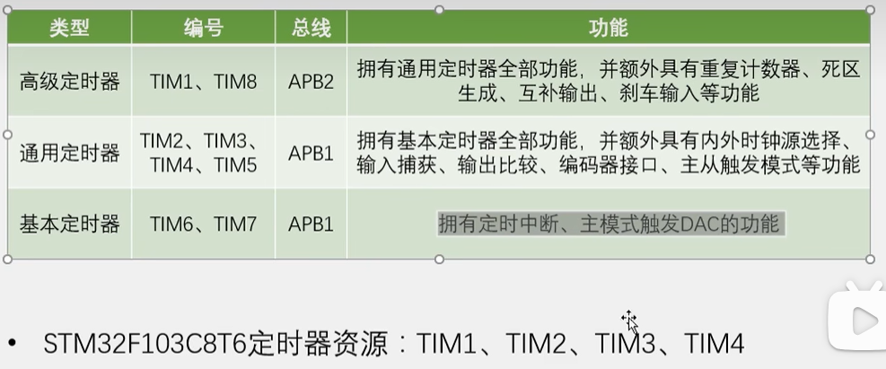
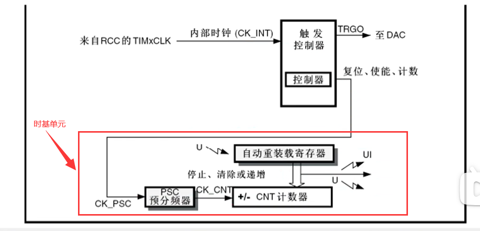
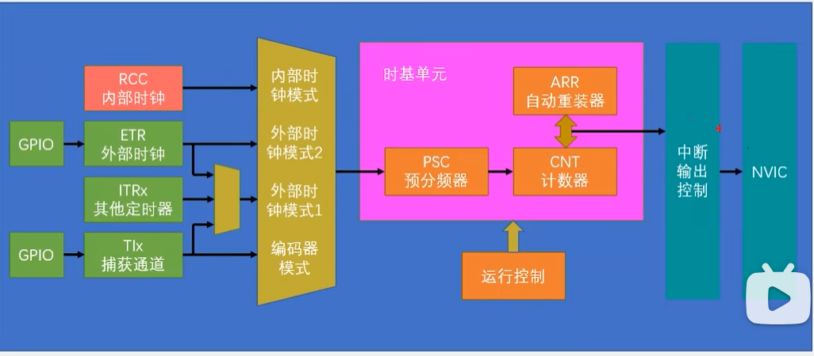
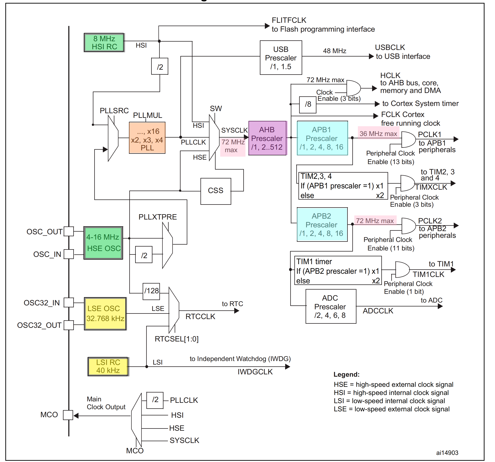
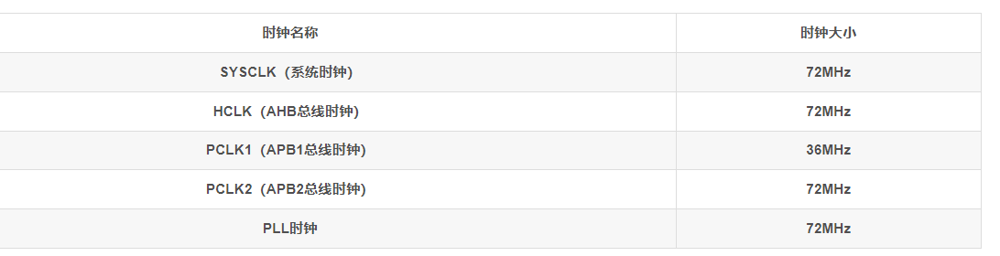

## 定时器基本功能：

定一个时间，定时器每隔这个时间段产生一个中断，来实现每隔一个固定时间执行一段程序的目的

## 定时器类型：



主模式触发dac的功能：它能让内部的硬件在不受程序控制下实现自动运行


## 基本定时器框图：



时基单元：
在基本定时器我们先看中预分频器对时钟进行预分频，
计数器自增计数（向上计数模式），当计数值计到自动重装值时，计数值清零同时产生更新中断和更新事件
在通用和高级定时器中，计数器支持向上计数模式、向下计数模式和中央对齐模式

## 定时中断基本结构：




## 时钟树：

时钟树是stm32中用来产生和配置时钟，并且把配置好的时钟发送到各个外设的系统。时钟是所有外设的基础，所以时钟也是最先需要配置的东西。程序中主函数之前还会执行一个systeminit的函数，这个函数就是用来配置时钟树的



#### 图中名词释义：

```
PLLXTPRE是一个分频器，它可以选择HSE时钟的一分频或二分频作为PLL的输入时钟源；
PLLSRC是一个选择器，它可以选择HSI时钟的二分频或HSE时钟（经过PLLXTPRE分频）作为PLL的输入时钟源；
PLLMUL是一个倍频器，它可以将PLL的输入时钟源进行2~16倍的倍频，得到PLL的输出时钟源；
prescalear：预分频。
CSS：时钟安全系统（Clock Security System，CSS）负责切换时钟，可以监测外部时钟的运行状态，一旦外部时钟失效，它就会自动把外部时钟切换回内部时钟。从而保证系统时钟的正常工作，防止系统卡死造成事故。

STM32 有5个时钟源：HSI、HSE、LSI、LSE、PLL。从时钟频率来分可以分成高速时钟源和低速时钟源，在这5个中HSI、HSE和PLL是高速时钟源，LSI和LSE是低速时钟源。从时钟来源来分可以分成外部时钟源和内部时钟源。外部时钟源就是从外部通过接晶振的方式获取时钟源。其中，HSE和LSE是外部时钟源，其他的是内部时钟源。
HSI（High Speed Internal）是高速内部时钟，RC振荡器，频率为8MHz，精度不高；
HSE（High Speed External）是高速外部时钟，可接石英/陶瓷谐振器，或者接外部时钟源，频率范围为4MHz~16MHz；
LSI（Low Speed Internal）是低速内部时钟，RC振荡器，频率为40kHz，提供低功耗时钟。独立看门狗的时钟源只能是LSI，同时LSI还可以做PTC的时钟源；
LSE（Low Speed External）是低速外部时钟，接频率为32.768kHz的石英晶体。这个主要是RTC的时钟源。
PLL为锁相环倍频输出，其时钟输入源可选择为HSI/2、HSE或者HSE/2。倍频可选择为2~16倍，但是其输出频率最大不得超过72MHz。

```

#### ST配置时钟的流程：

首先启动内部时钟，选择内部八兆赫兹为系统时钟，暂时以内部八兆赫兹的时钟运行，然后再启动外部时钟，配置外部时钟，进入**PLL（锁相环）倍频器**（用于将输入的时钟信号进行倍频，以提高系统时钟的频率。PLL的输入时钟源可以是HSI/2或者HSE，倍频系数可以是2~16之间的整数）。PLL的输出时钟可以作为系统时钟或者提供给USB预分频器或者MCO，倍频八兆赫兹，倍频九倍，得到72兆赫兹，等到锁相环输出稳定后，选择锁相环输出为系统时钟，这样就把系统时钟由八兆赫兹切换为了72兆赫兹。
在systeminit的函数里，时钟树从中间画一个界线，左边的都是时钟的产生电路，右边的都是时钟的分配电路，中间的这个system clock就是系统时钟72兆赫兹，在时钟产生电路，有四个震荡源，分别是内部的8MHZ高速RC振荡器，外部的4-16MHZ高速石英晶体振荡器，也就是晶振，一般都是接八MHZ，外部的32.768千赫兹低速晶振，这个一般是给RTC提供时钟的，最后是内部的40千赫兹低速RC振荡器，这个可以给看门狗提供时钟。上面的两个高速晶振，是用来提供系统时钟的，我们AHB、APB2、APB1的时钟都是来源于这两个高速晶振，这里内部和外部都有一个八兆赫兹的晶振，都是可以用的。只不过是外部的石英振荡器比内部的RC振荡器更加稳定，所以一般我们都用外部晶振，例如USB 对时钟要求比较高，所以 PLLCLK 只能是由 HSE 倍频得到，不能使用 HSI 倍频。但是如果系统很简单，而且不需要那么精确的时钟，那也是可以使用内部RC振荡器的。这样就可以省下外部晶振的电路了。

#### stm32 hal库HSE/HSI时钟配置

**HSE 高速外部时钟信号**

HSE 是高速的外部时钟信号，可以由有源晶振或者无源晶振提供，频率从 4-16MHZ 不等。当使用有源晶振时，时钟从 OSC_IN 引脚进入，OSC_OUT 引脚悬空，当选用无源晶振时，时钟从OSC_IN 和 OSC_OUT 进入，并且要配谐振电容。HSE 最常使用的就是 8M 的无源晶振。当确定 PLL 时钟来源的时候，HSE 可以不分频或者 2 分频，这个由时钟配置寄存器 CFGR 的位 17：PLLXTPRE 设置，我们设置为 HSE 不分频。

**PLL 时钟源**

PLL 时钟来源可以有两个，一个来自 HSE，另外一个是 HSI/2，具体用哪个由时钟配置寄存器CFGR 的位 16：PLLSRC 设置。HSI 是内部高速的时钟信号，频率为 8M，根据温度和环境的情况频率会有漂移，一般不作为 PLL 的时钟来源。这里我们选 HSE 作为 PLL 的时钟来源。

**PLL 时钟 ——PLLCLK**

通 过 设 置 PLL 的 倍 频 因 子， 可 以 对 PLL 的 时 钟 来 源 进 行 倍 频， 倍 频 因 子 可 以是:[2,3,4,5,6,7,8,9,10,11,12,13,14,15,16]，具体设置成多少，由时钟配置寄存器 CFGR 的位21-18：PLLMUL[3:0] 设置。我们这里设置为 9 倍频，因为上一步我们设置 PLL 的时钟来源为HSE=8M，所以经过 PLL 倍频之后的 PLL 时钟：PLLCLK = 8M *9 = 72M。72M 是 ST 官方推荐的稳定运行时钟，如果想超频的话，增大倍频因子即可，最高为 128M。这里设置 PLL 时钟：PLLCLK = 8M *9 = 72M。

**系统时钟 SYSCLK**

系统时钟来源可以是：HSI、PLLCLK、HSE，具体的时钟配置寄存器 CFGR 的位 1-0：SW[1:0] 设置。我们这里设置系统时钟：SYSCLK = PLLCLK = 72M。

**AHB 总线时钟 HCLK**

系统时钟 SYSCLK 经过 AHB 预分频器分频之后得到时钟叫 APB 总线时钟，即 HCLK，分频因子可以是:[1,2,4，8，16，64，128，256，512]，具体的由时钟配置寄存器 CFGR 的位 7-4 ：HPRE[3:0]设置。片上大部分外设的时钟都是经过 HCLK 分频得到，至于 AHB 总线上的外设的时钟设置为多少，得等到我们使用该外设的时候才设置，我们这里只需粗线条的设置好 APB 的时钟即可。我们这里设置为 1 分频，即 HCLK=SYSCLK=72M。

**APB2 总线时钟 HCLK2**
APB2 总线时钟 PCLK2 由 HCLK 经过高速 APB2 预分频器得到，分频因子可以是:[1,2,4，8，16]，具体由时钟配置寄存器 CFGR 的位 13-11：PPRE2[2:0] 决定。HCLK2 属于高速的总线时钟，片上高速的外设就挂载到这条总线上，比如全部的 GPIO、USART1、SPI1 等。至于 APB2 总线上的外设的时钟设置为多少，得等到我们使用该外设的时候才设置，我们这里只需粗线条的设置好APB2 的时钟即可。我们这里设置为 1 分频，即 PCLK2 = HCLK = 72M。
**APB1 总线时钟 HCLK1**

APB1 总线时钟 PCLK1 由 HCLK 经过低速 APB 预分频器得到，分频因子可以是:[1,2,4，8，16]，具体的由时钟配置寄存器 CFGR 的位 10-8：PRRE1[2:0] 决定。HCLK1 属于低速的总线时钟，最高为 36M，片上低速的外设就挂载到这条总线上，比如 USART2/3/4/5、SPI2/3，I2C1/2 等。至于APB1 总线上的外设的时钟设置为多少，得等到我们使用该外设的时候才设置，我们这里只需粗线条的设置好 APB1 的时钟即可。我们这里设置为 2 分频，即 PCLK1 = HCLK/2 = 36M。

**USB 时钟**

USB 时钟是由 PLLCLK 经过 USB 预分频器得到，分频因子可以是：[1,1.5]，具体的由时钟配置寄存器 CFGR 的位 22：USBPRE 配置。USB 的时钟最高是 48M，根据分频因子反推过来算，PLLCLK只能是 48M 或者是 72M。一般我们设置 PLLCLK=72M，USBCLK=48M。**USB 对时钟要求比较高**，所以 PLLCLK 只能是由 HSE 倍频得到，不能使用 HSI 倍频。

**Cortex 系统时钟**

Cortex 系统时钟由 HCLK 8 分频得到，等于 9M，Cortex 系统时钟用来驱动内核的系统定时器SysTick，SysTick 一般用于操作系统的时钟节拍，也可以用做普通的定时。

**ADC 时钟**

ADC 时钟由 PCLK2 经过 ADC 预分频器得到，分频因子可以是 [2,4,6,8]，具体的由时钟配置寄存器 CFGR 的位 15-14：ADCPRE[1:0] 决定。很奇怪的是怎么没有 1 分频。ADC 时钟最高只能是 14M，如果采样周期设置成最短的 1.5 个周期的话，ADC 的转换时间可以达到最短的 1us。如果真要达到最短的转换时间 1us 的话，那 ADC 的时钟就得是 14M，反推 PCLK2 的时钟只能是：28M、56M、84M、112M，鉴于 PCLK2 最高是 72M，所以只能取 28M 和 56M。

**RTC 时钟、独立看门狗时钟**

RTC 时钟可由 HSE/128 分频得到，也可由低速外部时钟信号 LSE 提供，频率为 32.768KHZ，也可由低速内部时钟信号 HSI 提供，具体选用哪个时钟由备份域控制寄存器 BDCR 的位 9-8：RTCSEL[1:0] 配置。独立看门狗的时钟由 LSI 提供，且只能是由 LSI 提供，LSI 是低速的内部时钟信号，频率为 30~60KHZ 直接不等，一般取 40KHZ。

**MCO 时钟输出**

MCO 是 microcontroller clock output 的缩写，是微控制器时钟输出引脚，在 STM32 F1 系列中由PA8 复用所得，主要作用是可以对外提供时钟，相当于一个有源晶振。MCO 的时钟来源可以是：PLLCLK/2、HSI、HSE、SYSCLK，具体选哪个由时钟配置寄存器 CFGR 的位 26-24：MCO[2:0] 决定。除了对外提供时钟这个作用之外，我们还可以通过示波器监控 MCO 引脚的时钟输出来验证我们的系统时钟配置是否正确。

#### 总结时钟树的主要作用有以下几点：

	提供系统时钟（SYSCLK），即CPU内核工作的机器周期，决定了系统运行的速度；
	提供AHB总线时钟（HCLK），即高性能总线工作的频率，连接CPU、内存、DMA等高速设备；
	提供APB1和APB2总线时钟（PCLK1和PCLK2），即低速总线工作的频率，连接各种外设如GPIO、UART、TIM等；
	提供RTC时钟（RTCLK），即实时时钟工作的频率，用于提供精确的时间信息；
	提供USB时钟（USBCLK），即USB外设工作的频率，用于实现USB通信功能；
	提供MCO时钟输出（MCO），即微控制器时钟输出引脚，可以输出不同的时钟信号给外部设备；

#### SystemInit函数默认设置的系统时钟的大小：

