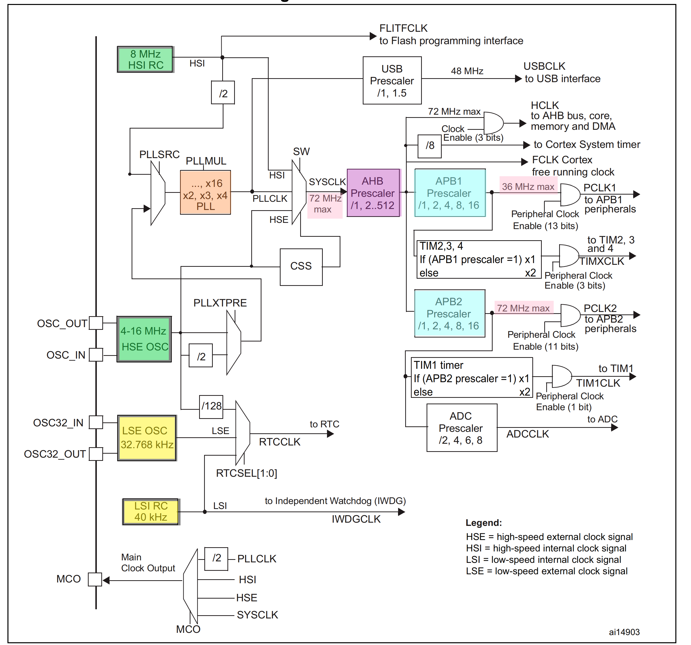
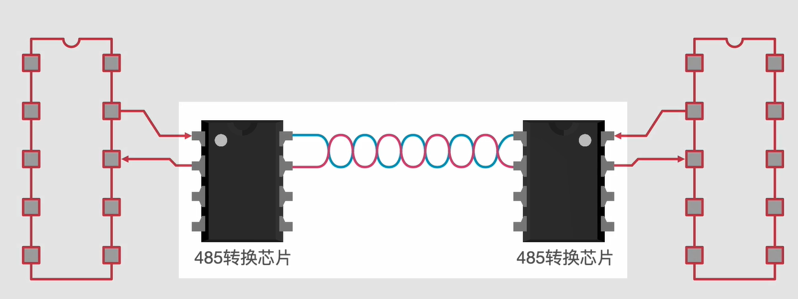

# 单片机


[TOC]


## 一、定义(本质是从内置的存储器中读取程序)

1.即mcu,相当于一个微缩型电脑，可以挂很多外设，当电压不匹配时，就要进行电压的转换（使用电平转换），或者用继电器：低电压去控制高电压/高电压控制低电压

2.可以挂很多外设（含传感器），和外设之间走的是不同的协议

3.单片机(MCU)：单个芯片就是一台计算机，**在一个芯片里封装了 cpu + 内存 + 硬盘** 

8051           MSC-51内核       8位单片机

avr

msp430     							16位单片机

stm32		cortex M内核	32位单片机

## 二、寄存器、库函数、hal函数

寄存器版本：使用较麻烦，每个设置都要去查看芯片datasheet，好处是可以让你熟悉芯片的寄存器配置。

库函数：是基于寄存器版本进行二次封装后推出的，它的优势就是寄存器版本的劣势，方便了使用，不再需要手动			去配置寄存器，使用更方便了。但是它的劣势就是HAL的优势，就是每次修改MCU功能，都需要手动去修			改功能，而且自己修改也不能保证正确性，程序代码在不同MCU之间的移植性不强。
HAL：HAL是Hardware Abstraction Layer的缩写，中文名称是：硬件抽象层，HAL库工程一般使用Cube软件来			生成工程。HAL库是ST公司为STM32的MCU最新推出的抽象层嵌入式软件，更方便的实现跨STM32产品的			最大可移植性。优势就是不需要开发工程师再关注所用MCU型号，只需要专注所以要的功能软件开发工			作。

​			hal库是st公司为了更方便地进行stm32之间的移植而开发的库，通用性很强，在不同的两款stm32芯片之			间的移植基本上不需要修改。之前使用的标准库都是基于寄存器的操作。

## 三、总线

数据总线   （输入、输出，用于跑数据）、

地址总线   （跑地址）、

控制总线   （跑指令）


 冯诺依曼架构：指令和数据总线不分开，有瓶颈，不可以同时进行 

哈佛架构：指令和数据总线分开，无瓶颈，可以同时进行 ，如下图:


数据总线的宽度决定了每次能读到的数据量；地址总线的宽度(也就是 地址线用多少根线来传输的)决定了寻址范围      

```
比如：
1. 16 根数据线时，cpu想访问存储器某个地址，就像告诉存储器：“我想读你的x地址”（此时，x取值范围 16个0 至16个1的二进制 ，转十进制就是0~（2^16-1），最大能访问65536 Byte，1024=2^10，即64KB；
2. 同理20根地址总线可以寻址的存储器空间是 2B的20次方 = 1MB； 
3. 32根地址总线的寻址空间是 2B的32次方 = 4GB；这也是为什么32位地址总线的系统的最大能搭配4GB内存的原因：再多的话CPU就找不到了。 
```

计算机最小的单位是位（bit），每8位组成一个字节（Byte），字节（B）也是存储器的最小存储单元。 

```
1024bit = 128Byte
1Byte= 8 bit
1KB = 1024Byte
1MB=1024KB
1GB=1024MB
```


|地址总线始终为16根|数据总线为8根|数据总线为16根 case1|数据总线为16根 case2|
|-|-|-|-|
|我想读取0x1地址|0x1处的1Byte data|0x1处的1Byte data + 0x2处的1Byte data|0x1处的2Byte data|
|我想读取0x2地址|0x2处的1Byte data|0x3处的1Byte data + 0x4处的1Byte data|0x2处的2Byte data|
|我想读取0x3地址|0x3处的1Byte data|0x5处的1Byte data + 0x6处的1Byte data|0x3处的2Byte data|
|我想读取0x4地址|0x4处的1Byte data|0x7处的1Byte data + 0x8处的1Byte data|0x4处的2Byte data|
|我想读取0xn地址|0xn处的1Byte data|0xn*2-1处的1Byte data + 0xn * 2处的1Byte data||
|我想读取0xffff地址|0xffff处的1Byte data|0xffff*2-1处的1Byte data + 0xffff\*2处的1Byte data||


内存模型

|offset|bit0|bit1|bit2|bit3|bit4|bit5|bit6|bit7|
|-|-|-|-|-|-|-|-|-|
|0x1|0|0|0|0|0|0|0|0|
|0x2|0|0|0|0|0|0|0|0|
|0x3|0|0|0|0|0|0|0|0|
|0xffff|0|0|0|0|0|0|0|0|

- ### 判断：

如果一个cpu，它的地址总线只有16根，~~那它最大就只支持64KB内存~~？

8数据线  每次读1Byte，读完64KB ，需要读64K次。

16数据线  每次读2Byte，读完64KB ，需要读32K次。如果读64K次 则内存翻倍


## 四、什么叫cortex M内核？

arm有不同的产品；https://baike.baidu.com/item/cortex/4476976?fr=aladdin

ARM7没有MMU(内存管理单元)，只能叫做MCU（微控制器），不能运行诸如Linux、WinCE等这些现代的多用户多进程操作系统， 因为运行这些系统需要MMU，才能给每个用户进程分配进程自己独立的地址空间 。

 


**ARM11之后更改命名为Cortex系列（三条产品线：A/M/R）** https://betheme.net/news/txtlist_i110768v.html?action=onClick,  

Cortex系列属于ARMv7架构，是ARM公司最新的指令架构。

**内核基于架构，芯片基于内核**

**指令集**		**内核             		 架构**

​				ARM7：                  ARMv4 架构

​				ARM9：                   ARMv5 架构

​				ARM11：                 ARMv6 架构

​				ARM-Cortex 系列：ARMv7架构

例如：STM32是基于ARMv7架构下cortexM3 内核的芯片，具有32位地址总线

芯片内部结构：内核+外设，如下：


```
cortexA：主打高端，手机 平板

cortexM：主打单片机
            M1：？？？

            M3：stm32f103c8t6

            M4：stm32f407zgt6

            M7：stm32f705

cortexR ：主打车规级别，realtime 实时性。

```

## 五、电子行业上下游

- arm 整理了一套怎么设计arm芯片的教程

- 芯片公司问arm买，然后设计出来芯片蓝图，交给台积电 去生成成芯片成品

- 板卡公司 再买芯片，并画好对应的电路板

- 终端公司 买别人电路板，加个外壳 就是产品

- 再把一件件电子卖给消费者

------


## 六、位操作

与或非

将reg设

reg |= 1 << 3; 相当于 reg = reg | 1(<<3)

改第3位(从0开始记数)：reg = 0x65 (b'0110 0101)  = > b'0110 1101 (0x6D)

reg = 0x6D

​        1<<3 (b'1-> b'1000)

​         reg = reg | b'1000

​         b'0110 0101  | b'1000 = b'0110 1101


 C语言中，有时需要进行置位操作，比如针对其中的某些位。这样做的目的是既达到了目标，又不会影响其它位。常用的置位操作如下：

\#define  setbit(x,y)  x|=(1<<y) //将X的第Y位置1
\#define  clrbit(x,y)   x&=~(1<<y) //将X的第Y位清0

   举个例子：

```c

int main(int argc, char* argv[])
{
   unsigned char old_value = 0x55;  //   b'01010101
   unsigned char new_value_1 = old_value |(1<<1);   //第一位置1
												  //=  b'01010101 | (b'0000 0010)
​			 									//= b'010101**1**1

   unsigned char new_value_2 = old_value &~(1<<2);  //第二位置0

​												  //=  b'01010101 & ~(b'0000 0100)

​												  //=  b'01010101 &  (b'1111 1011)

​												 //= b'01010**0**01

   printf("Hello World! 0x%x,0x%x/n",b,c);
   return 0;
}

```

输出0x57，0x51。0x57即从01010101，变成010101**1**1；0x51即从01010101，变成01010**0**01。


## 七、数字电路和模拟电路区别 

- ### 区别

| 数字电路                             | 模拟电路                       |
| ------------------------------------ | ------------------------------ |
| 关心电信号的有无(灯泡亮没亮？)       | 关心电信号的强弱(灯泡亮没亮？) |
| 算法复杂                             | 精确的分辨率                   |
| 抗干扰能力好                         | 抗干扰能力差                   |
| 数字信号是是离散的（0、1）           | 模拟信号是连续的               |
| 便于加密处理 ； 便于存储、处理和交换 |                                |

- ### 模拟数字转换器ADC- analog to digital converter

  


## 八、STM32系统基本结构


DMA的作用就是实现数据的直接传输，而去掉了传统数据传输需要CPU寄存器参与的环节

### 结合时钟树：



### Cortex-m相当于微型计算机的cpu

### **GPIO基本结构**

（主要包含寄存器和驱动器，寄存器就是一段特殊的存储器，内核可以通过APB2总线对寄存器进行读写，从而完成输出电平和读取电平的功能）


​            stm32内部的寄存器都是32位的，每一位对应一个引脚，但是寄存器的端口只有16个，所以输入数据寄存器和输出数据寄存器只有低16位的有端口，高16位是没有用到的。

​            驱动器用于增加信号的驱动能力，寄存器只负责存储数据，读写寄存器实际上就是在读写特定区域的内存上的数值，如果要进行点灯这样的操作，还是需要驱动器来负责增大驱动能力

### STM32存储器


总结：越往下容量越大，越往上速度越大（寄存器也是一种特殊的存储器）

RAM，ROM，FLASH
ROM(Read Only Memory)只读存储器和RAM(Random Access Memory)随机存储器都是半导体存储器。ROM 掉电不丢失，RAM 掉电丢失。

#### RAM

RAM分为两大类，一种是静态RAM(Static RAM 即**SRAM**),另一种是动态RAM(Dynamic RAM,即**DRAM**)。 

SRAM，所谓“静态”是指只要一直通电，存储在SRAM中的数据就不会丢失。SRAM是目前为止读写最快的存储设备，它经常被用在CPU的一级缓冲，二级缓冲。价格昂贵。

DRAM,所谓“动态"是指保留数据时间很短，不但要一直通电，还要及时刷新数据来保存数据。读写速度比SRAM慢，但是要比ROM快。DRAM分为很多种，常见的有FPRAM/FashPAGE,EDORAM,SDRAM,DDR RAM,RDRAM,SGRAM以及WRAM等。DDR RAM(Date - Rate RAM)也被称作为DDR SDRAM,这种改进型的RAM 和SDRAM不同之处在于它可以一个时钟读写两次数据，这样就使数据传输的速度加倍了。目前电脑用的最多的内存就是DDR RAM，许多高端的显卡中也配有DDR RAM 来提高带宽。

#### ROM

ROM可以分为PROM,EPROM,EEPROM。PROM是一次性的，也就是软件灌入之后无法修改了，现在已经被淘汰了。Eprom是一种通用的存储器，它是通过紫外线的照射来擦出的。E2PROM 是通过电子擦出的，但写入时间很慢。

#### Flash（例如电脑上的ssd固态硬盘、手机里的存储硬盘、U盘、存储卡）

Flash存储器又称为闪存，**存储介质是闪存芯片**。它结合了ROM和RAM的长处，不仅具备电子可擦除可编程（EEPROM）的性能，还不会断电丢失数据同时可以快速读取数据（NVRAM的优势），U盘和MP3就是用的这种存储器。**近年来Flash全面代替了ROM(EPROM)在嵌入式中的地位，用作存储Bootloader 以及操作系统或者程序代码或者直接当作硬盘使用**

### stm32八种io口工作模式

## 			

1、上拉输入：
IO口在无输入的情况下，保持高电平。

2、下拉输入：
IO口在无输入的情况下，保持低电平。

3、浮空输入：
浮空输入状态下，IO的电平状态是不确定的，完全由外部输入决定，如果在该引脚悬空的情况下，读取该端口的电平是不确定的。

4、模拟输入：
输入信号不经施密特触发器直接接入，输入信号为模拟量而非数字量，其余输入方式输入数字量。

5、推挽输出（Push-Pull）

- 路径：通过设置位设置/清除寄存器或者输出数据寄存器的值，途经P-MOS管和N-MOS管，最终输出到I/O端口。

- 当设置输出的值为高电平的时候，P-MOS管处于开启状态，N-MOS管处于关闭状态，此时I/O端口的电平就由P-MOS管决定：高电平；

- 当设置输出的值为低电平的时候，P-MOS管处于关闭状态，N-MOS管处于开启状态，此时I/O端口的电平就由N-MOS管决定：低电平。

- I/O端口的电平也可以通过输入电路进行读取；注意，此时I/O端口的电平一定是输出的电平

  

6、开漏输出

- 路径：通过设置位设置/清除寄存器或者输出数据寄存器的值，途经只有N-MOS管，最终输出到I/O端口。

- 当设置输出的值为高电平的时候，N-MOS管处于关闭状态，此时I/O端口的电平就不会由输出的高低电平决定，而是由I/O端口外部的上拉或者下拉决定；

- 当设置输出的值为低电平的时候，N-MOS管处于开启状态，此时I/O端口的电平就是低电平。

- I/O端口的电平也可以通过输入电路进行读取；注意，I/O端口的电平不一定是输出的电平。

  

7、复用推挽输出：此时IO受内部外设控制，比如定时器的PWM,比如SPI的MOSI,MISO等。 而普通的推挽输出，则IO受ODR控制。

8、复用开漏输出：参考复用推挽

**复用功能**
STM32Fxx系列单片机的GPIO引脚可以配置为浮空输入（Input Floating）、上拉输入（Input Pull-up）、下拉输入（Input Pull-down）、模拟量（Analog）、开漏输出（Output Open-drain）、推挽输出（Output Push-pull）、复用开漏（Alternate function open-drain）输出和复用推挽（Alternate function push-pull）输出等八种模式。

先来介绍下开漏输出和推挽输出的区别：

STM32Fxx系列单片机的输出电路有两个MOS管：P-MOS和N-MOS。

在开漏输出模式下，P-MOS管不工作，只有N-MOS管起作用。若输出数据寄存器的值为0，则N-MOS导通，IO口输出低电平；若输出数据寄存器的值为1，则N-MOS截止；由于P-MOS不工作，此时IO口既不是高电平，也不是低电平，这种状态被称为高阻态。

在推挽输出模式下，若输出数据寄存器的值为0，则N-MOS导通，P-MOS截止，IO口输出低电平；若输出数据寄存器的值为1，则N-MOS截止，P-MOS导通，IO口输出高电平；

我们知道STM32Fxx单片机还有复用开漏输出和复用推挽输出，它们和上面讲到的（普通）开漏输出和（普通）推挽输出有什么区别呢？

这就涉及到针脚的复用功能。

我们知道，STM32Fxx内部集成了很多的外设控制器，比如USART、SPI、bxCAN等等，这些外设控制器，也需要通过引脚与外设连接。复用功能是相对于单片机的引脚而言的。所谓“复用功能”，是指单片机的引脚既可以做普通GPIO使用，也可以作为内部外设控制器的引脚来使用。

比如我们来看看STM32F103xx单片机的PA5引脚，首先，PA5可以做为普通GPIO来使用；其次，如果作为外设的引脚，它可以作为SPI1的时钟（SPI1_SCK）、DAC的输出通道1（DAC_OUT1）或者ADC的输入通道5（ADC12_IN5）。

PA5支持的三种外设（SPI1、DAC、ADC）在同一时刻只能选择一种，选择的方法是开启相应外设的时钟，并使其它外设的时钟保持关闭状态。如果PA5被配置为复用功能，但是没有开启它支持的任何外设的时钟，它的输出是不确定的。

复用推挽输出和（普通）推挽输出在输出的时候均使用两个MOS管（P-MOS和-MOS），其输出电路是相同的。区别在于控制输出的信号来源：（普通）推挽输出控制MOS管的信号来自输出数据寄存器，而复用推挽输出的控制信号来自单片机的内置外设控制器（比如SPI1）。

复用开漏输出和（普通）开漏输出的道理是一样的。

下面这张图，是普通GPIO输出的引脚配置图，可以看到其输出信号来自输出数据寄存器（Output data register）：


下面这张图，是选择复用功能后的引脚配置图，可以看到其输出信号来自芯片内置的外设控制器：


### GPIO七种相关配置寄存器：


$$
GPIO配置寄存器：每一个端口模式由4位进行配置，所以每个GPIO的16个端口由64位来配置，需要两个寄存器，一个端口配置低寄存器，一个端口配置高寄存器
 
 端口输入数据寄存器：低16位对应16个引脚，高16位没有使用
 
 端口输出数据寄存器：低16位对应16个引脚，高16位没有使用
 
 端口位设置\清除寄存器：高16位用于位清除，低16位用于位设置。写1是设置或者清除，写0不产生影响。方便同时对多个端口进行位设置和位清除，保证位设置和位清除的同步性
 
 端口位清除寄存器：低16位和上面寄存器高16位功能相同，为了方便操作而设置。例如只想单一的进行位设置或者位清除时，可以用上面寄存器来位设置，此寄存器进行位清除，因为他们都是使用的低16位，会方便一些，适合对同步性要求不高的情况
 
 端口配置锁定寄存器：对端口的配置进行锁定，防止意外更改
$$

### GPIO输出高低电平的三种写法：

$$
GPIO_WriteBit与GPIO_SetBits的区别。
GPIO_WriteBit是对一个IO口进行写操作，可以是写0或者写1；而GPIO_SetBits可以对多个IO口同时进行置位1。
例：
对单个IO口置0或1：
GPIO_WriteBit(GPIOA,GPIO_Pin_8 , 0);
同时对多个IO口置1：
GPIO_SetBits(GPIOD,GPIO_Pin_0 | GPIO_Pin_5 | GPIO_Pin_6);
$$


推挽输出高低电平均有驱动能力，开漏输出只有低电平才有驱动能力

### **gpio位结构**


- GPIO_ReadInputData读的是GPIOx的整个IDR寄存器的数据，返回一个十六位数，对应IDR寄存器的十六位。反映GPIOx所有端口的电平状态，所以参数只用传入GPIOx。
- GPIO_ReadInputDataBit读的是GPIOx的IDR寄存器中的一位数，返回值不是0就是1。反映GPIOx的某个端口的电平状态，读哪一位由参数GPIO_Pin决定。
- GPIO_ReadInputData读的是GPIOx的整个IDR寄存器的数据，返回一个十六位数，对应IDR寄存器的十六位。反映GPIOx所有端口的电平状态，所以参数只用传入GPIOx。
- GPIO_ReadOutputDataBit和GPIO_ReadOnputData则正好相反

## 九、STM32外部的设备和电路


因为很多单片机或者芯片，都使用了高电平弱驱动，低电平强驱动的规则，led灯的硬件模型通常选第一种：单片机给低电平，导通电路，灯点亮，给高电平则反之；

图3图4都是左边是基极，带箭头是发射极，其他是集电极。图3基极给低电平，三极管导通，蜂鸣器有电流。图4基极给高电平，三极管导通，蜂鸣器有电流（pnp、npn知识待补充）

**面包板**：

## 十、单片机常见通信协议基础知识

### 1.串口通讯


1. TX: 单片机信号的发送

​        RX：单片机信号的接收

​        GND：地线，两个单片机的参考电压

2. 波特率**就是发送或接收数据的速度。。一般我们常见的波特率有：1200、2400、4800、9600、19200、38400、57600、115200等。**

3. **常见的**帧格式**有10位，一般是以起始位开始（低电平），停止位结束（高电平），中间的8位依次为数据为，并且数据的内容是由我们用户定义的。8位为一个字节。（还有其他的帧格式，数据位只有七位或者五位）校验位就是用来校验数据为传输的准确性，相当于can协议里面的CRC，在发出数据之前对数据进行计算。

   起始位：0     数据位：0/1   终止位：1

​	


  

  ​          4. **异步通讯**：①不要求收发双方时钟的严格一致，容易实现，设备开销较小，但每个字符要附加2~3位							用于起止位，各帧之间还有间隔，因此传输效率不高。

  ​		5. 采用的是**TTL逻辑**：其高电平范围为2.4V~5V，低电平最大为0.4V，其**抗干扰能力非常弱**，随便给一      个静电就有可能将原来的低电平变高，导致通讯出现异常。

  ​        6.适用于一米之内，距离短（例如芯片和芯片之间，单片机和电脑之间）

  

  ​     7.全双工通讯

### 2.RS232（recommended standard 232）


​		

1. 通讯原理：在原来接口通讯的基础上添加一个“电平转换芯片”，例如MAX232，从而将TTL电平转换为232电平，后续再将232信号转换为单片机能识别的TTL信号
2. 15米内
3. 抗干扰能力增强
4. 波特率：20k, 即19200
5. 全双工通讯

### 3. RS485




1.原理：在串口通讯的基础上添加了“电平转换芯片”——485转换芯片，该芯片可以将输入的串口信号转换为差分信号，也可以将差分信号转换为单片机能识别的TTL信号。差分信号只需要两根线，不需要地线，用两根线的差值来表现0和1，抗干扰能力强。两根线以双绞线形式缠绕在一起，即使两根线受到干扰也是一起受到干扰，电压差值不变（CAN/RS-485为什么要用双绞线：https://baijiahao.baidu.com/s?id=1627416653858786002&wfr=spider&for=pc）

2.传输距离：1200米，

3.频率： 50M

4.**半双工通讯**

​	

5.可以进行一主多从通讯——可以和很多设备进行通讯（如：查电表）。而RS232和串口通讯只能点对点

​		

### 4、总线通讯

（1）**USB**

（2）**IIC（半双工通信，传输距离15m，传输速度100kbps-400kbps,高速模式下3.4Mbps`）**


（3）**SPI（全双工通信, 传输距离1-3m）**·		


(4)CAN

(5)I2S

需要几根线？每根线含义？单工、全双工还是半双工    通讯最大速率/最远距离    


## 十一、单片机实验

- 串口   

- GPIO输出  输入

- 中断

- 定时器

- ### 看门狗 watch dog timer

  本质是定时器，用于解决单片机死机的问题
  如下图示例：如果单片机运行正常，看门狗永远不会触发单片机复位，而当程序死机以后，程序不会回到第一步去喂狗了，50ms过去，触发终断机制,进行重启。如果没有喂狗环节，每过50ms单片机复位一次，这样高频复位造成的后果远远严重于死机，此时看门狗会变成一条疯狗，所以一定要有喂狗操作

  

- IIC 

- SPI

- DMA

- PWM

- 点屏

- USB

- HDMI

- 

- 

## GPIO输入

传感器模块介绍：传感器元件(光敏电阻、热敏电阻、红外接收管等)的电阻都会随着环境的光线、温度等模拟量进行变化，通过与定值电阻分压即可得到模拟电压输出，再通过电压比较器进行二值化即可得到电压输出

c语言数据类型和对应的st叫法：


