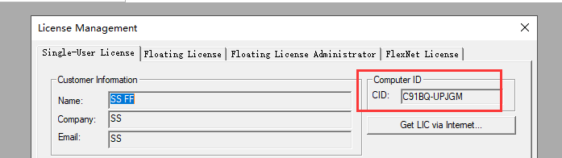
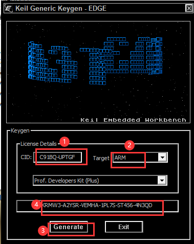
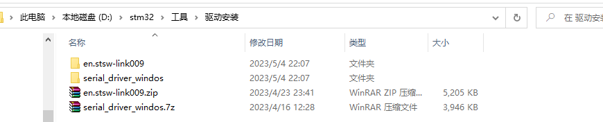
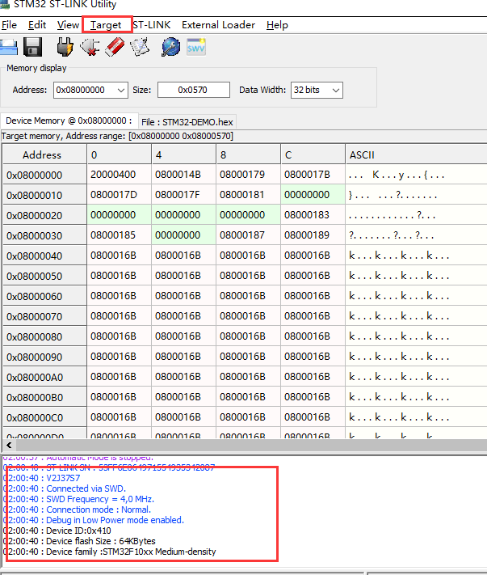
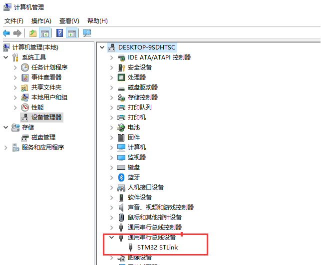
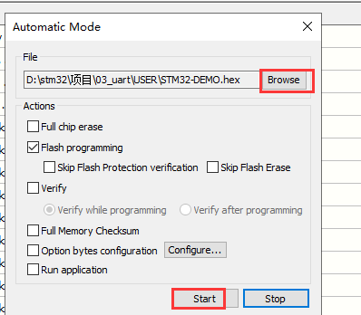
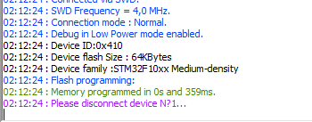
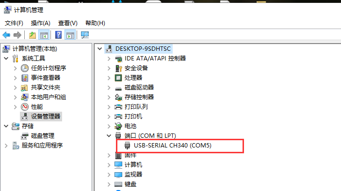
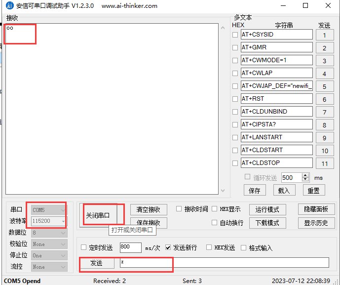
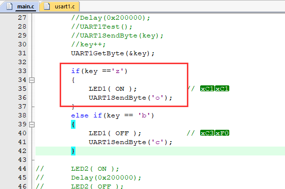

# STM32 keil开发环境搭建\ST-LINK Utility程序烧录方法\串口调试助手

[TOC]

### 一、STM32 keil开发环境搭建

**keil相关安装包：**

​		

1.点击mdk538a.exe，安装keil编程软件

2.安装pack工具包

3.安装pack包

4.安装MDKCM525包，兼容以前版本的包

5.关闭keil，在keil图标上右键打开，切换管理员模式，打开后点击file-License Management，复制cid

6.打开破解软件keygen，复制keil的cid过来，改target为arm，生成破解码

	

7.粘贴生成的破解码，回到keil，粘贴到license amnagement下的LIC

以上，即完成了电脑安装keil，用keil写好代码并编译，生成.axf文档和单片机的固件（格式为.hex，自动生成在项目代码附近），相当于单片机的程序。

keil配置好stlink（电脑配套硬件调试器——jlink、stlink）后可以直接用于烧录.axf，也可以用stlink utility进行代码烧录，将项目固件.hex烧录进单片机

### 二、安装STLINK和串口转换小板的驱动

### 三、STM32 ST-LINK Utility程序烧录方法

1.打开软件过后点击Target-connect，出现以下界面表示STlink链接成功

如果出现没有检测到stlink的话，首先查看是否安装驱动程序，或者桌面点击此电脑-右键“管理”-设备管理器-查看通用串行总线设备分页是否有STM32 STLink，如果没有，那就需要安装驱动设备后，再重新插拔电脑usb口的stlink连接线（或者链接到主机后方的usb口）再重复以上步骤链接

2.链接成功过后再次点击Target然后点击AutoMatic Mode，然后选择升级的HEX文件，然后点击Start

显示以下信息表示程序烧录完成

3.单片机循环跑这个程序

### 四、运行串口调试助手来打印日志（电脑连接配套硬件串口小板，usb端和电脑连接，串口端和单片机连接）

1.电脑连接串口转换小板，同时连接单片机。计算机管理里面查看串口小板的端口，如图显示为com5

2. 打开串口调试助手，如：安信可软件，配备串口号、波特率、打开串口，与单片机进行信息发送与接收。

