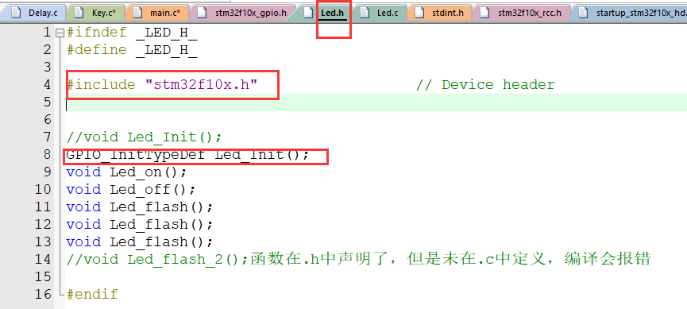
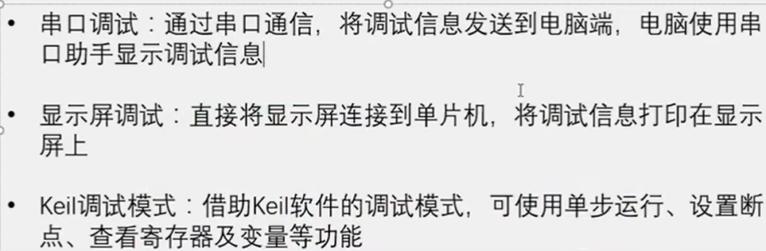

## 1.C语言中 .h文件和.c文件区别

一、意思不同

1. .h中一般放的是同名.c文件中定义的变量、数组、函数的**声明**，需要让.c外部使用的声明。
2. .c文件一般放的是变量、数组、函数的**具体定义**。
3. 独立的项目.c文档中定义，对应的.h文档中声明，最终在main.c文档中调用

二、用法不同

1. .h文件，称为**头文件**，一般存储类型的定义，函数的声明等。通常，头文件被.c文件包含，使用#include 语句。但值得注意的是，这只是一种约定，而非强制。

   

   上图中led.h中需要用到gpio相关的函数，先include "stm32f10x.h",再在led.c中include对应的.h即可

2. .c文件，以c为扩展名，一般**存储具体功能的实现**。

3. main.c中声明所要用到的.h即可，不用再次声明其他.c文件中的函数

4. 

   定义：不要分号，类型、返回值，函数体，reture都要写全
   声明：写类型、分号
   调用：不要类型、要写分号，有参数要传参数

## 2.调试方法

## 3.rc rcc rtc的区别

在微控制器和电子系统的领域中，"RC"、"RCC" 和 "RTC" 是三个不同的术语，它们代表着不同的概念：

1. **RC（Resistor-Capacitor）振荡器**：
   - "RC" 通常指的是一种基于电阻器（Resistor）和电容器（Capacitor）的振荡器。
   - RC振荡器是一种简单的振荡电路，用于生成近似的时钟信号或振荡波形。这种振荡器的频率可通过调整电路中的电阻和电容值来改变。
   - RC振荡器通常不如晶体振荡器那样精确或稳定，但它们成本较低，制作简单。
2. **RCC（Reset and Clock Control）**：
   - 在像STM32这样的ARM Cortex-M微控制器中，"RCC" 指的是复位和时钟控制单元。
   - RCC负责管理微控制器的时钟系统，包括系统时钟、外设时钟和时钟源（如内部RC振荡器、外部晶体振荡器等）。它也控制着微控制器的复位逻辑。
   - RCC允许配置不同的时钟源和时钟树，以及管理各种时钟域和时钟分频，对于优化性能和功耗至关重要。
3. **RTC（Real-Time Clock）**：
   - "RTC" 是实时时钟的缩写，它是一种计时组件，用于保持精确的日期和时间，即使在主微控制器或系统电源关闭的情况下也能运行（通常通过电池供电）。
   - 在微控制器系统中，RTC常用于提供时间戳、唤醒系统、执行定时任务等。它通常具有自己的晶体振荡器，能够以非常低的功耗保持时间的准确性。

总结来说，RC是一种基本的振荡电路类型，RCC是微控制器中的一个功能模块，负责时钟管理，而RTC是一种维持实时日期和时间的组件。

## 4.晶振给rtc供电吗

lse晶振（晶体振荡器）本身不是用来给实时时钟（RTC）或任何其他电路供电的，而是用于提供一个稳定和精确的时钟信号。在微控制器系统中，特别是对于实时时钟（RTC）模块，晶振的作用是生成一个准确的时间基准，使得RTC能够以极高的精度跟踪时间。

RTC通常由以下两部分组成：

1. **时钟源**：这通常是一个低频率的晶振，比如32.768 kHz的石英晶振。这个频率被选择是因为它可以精确地分频以生成一秒钟的时钟脉冲。
2. **备用电源**：RTC模块通常需要在主系统电源关闭时继续运行，因此它们通常会连接到一个小电池或超级电容器。这个备用电源确保即使在主电源断开的情况下，RTC仍能继续运行并保持时间。

晶振只负责为RTC提供稳定的时钟信号，而不是电力。晶振的作用是确保RTC能够以非常精确的频率运行，这对于保持准确的时间非常重要。电力供应是由微控制器的电源系统或专门的备用电源来提供的。

晶振（晶体振荡器）本身不能永远自发地产生时钟信号。晶振的工作原理基于石英晶体的压电效应，当外部电压施加到晶体上时，它会产生一个精确和稳定的振荡频率。这个特性使得晶振被广泛用于电子设备中，以提供稳定的时钟信号或参考频率。

但晶振的持续运行需要几个条件：

1. **外部电源**：晶振需要外部电源来激发和维持振荡。没有电源，晶振就不会产生时钟信号。
2. **晶体的物理特性**：随着时间的推移，晶体的物理特性可能会因为各种因素（如温度变化、机械应力、老化等）而逐渐变化，这可能会影响晶振的频率稳定性和准确性。
3. **环境因素**：极端的温度、湿度、机械震动等环境因素都可能对晶振的性能产生负面影响。

因此，虽然晶振是一种非常稳定和可靠的时钟源，但它们并不能“永远”自发地产生时钟信号，其性能和寿命受到多种因素的影响。在设计电子系统时，通常会考虑这些因素，并在必要时进行晶振的更换或校准。

