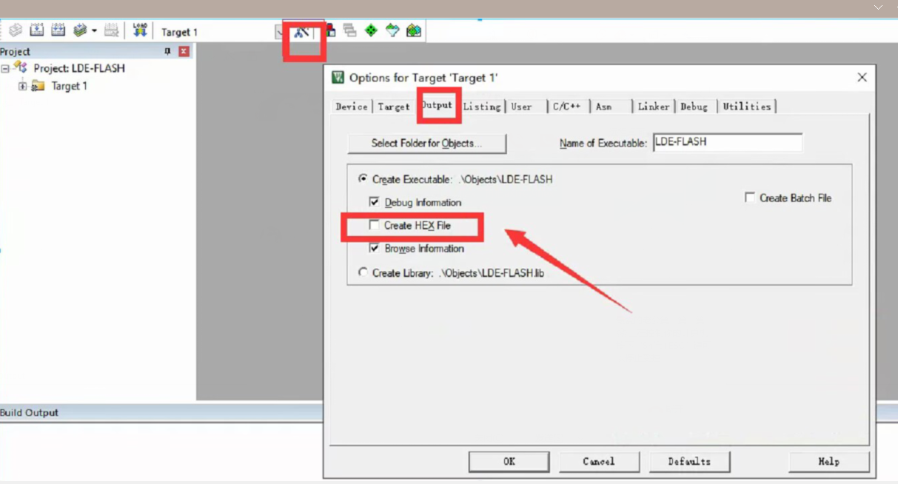

## 用keil新建工程的步骤

[TOC]

### 1.建立工程文件夹，keil中新建工程，选择型号

出现此👇页面，点击关闭

### 2.工程文件夹里建立CMSIS、FWlib、User等文件夹，复制固件库里面的文件到工程文件中。

（1）FWlib：库函数。.h用于声明.c，所以src文件夹和inc文件夹完全对应。

（2）**CMSIS**:比库更底层，包含启动文件、核心文件。（SystemInit定义在system_stm32f10x.c中,主要初始化了STM的时钟系）

​           

​			启动文件以.s或者.asm结尾，用于配置硬件环境，电脑通电后，会优先跑启动文件，构建基本的c语言运行环境，然后再去跑c语言代码

1

​			

（3）USER：项目代码相关(项目文件为.uvproj)，listing中是编译过程中产生的文件，多次执行会覆盖之前的执行文件。添加以下文件到USER文件夹中,

stm32f10x_conf.h :将stm32f10x系列芯片涉及到的外设头文件全部组织在一起

stm32f10x_it.c和stm32f10x_it.h是存放STM32工程中所有中断函数的模板文件

### 3.keil工程里对应建立CMSIS、FWlib、User等同名称的分组，然后将文件夹内的文件添加到工程分组中，注意仅添加.c文件

👇user中添加.c文件：

👇CMSIS中添加.c文件：

​		只添加startup中项目对应的启动文档，例如md.s，在工程选项-c/c++-Define内定义时也要改成对应的md：USE_STDPERIPH_DRIVER, STM32F10X_MD

👇FWlib中添加.c文件：

​		.c文件如果被添加到keil工程分组中就会被编译，而点灯通常只需要用到gpio和rcc相关的.c文件，所以可以只添加这两个，加快工程执行效率。

### 4.工程选项（魔法棒图标），Target，Code Generation ARM Complier内选择编译器版本，建议选择较低版本的 version 5。

![image-20230709012923147](新建工程的步骤.assets/image-20230709012923147.png

### 5.工程选项，Output，勾选Create HEX File图标。

​		如果是用stlink utility下载软件，必须转化为hex，如果使用keil下载软件，不用勾选。因为电脑会将每个.c文档编译为对应的同名的.o文档，再把所有的.o合成一个.axf，当通过烧录器如JLink、ST-Link进行烧录或在线调试时，就是把axf附件下载到单片机中。如果勾选了hex，再将axf文档转为hex。

### 6.工程选项，C/C++.Include Paths内声明所有包含头文件的文件夹；定义使用标准外设驱动,如：USE_STDPERIPH_DRIVER, STM32F10X_HD（根据实际项目所需的启动文件来调整）

可以勾选C99 Mode。（原因见最下方的常见问题）

**添加含有.h的文件夹具体步骤：**

👇添加USER文件夹。此处看不到USER目录下有.h文件，但是如果打开桌面创建的工程文件夹，就会发现USER目录中添加的.h文件。

👇添加FWlib文件夹下的inc文件夹，inc即include，其中包含的全是.h类型的声明文件。

👇添加CMSIS文件夹。与USER类似，此处看不到CMSIS目录下有.h文件，但是如果打开桌面创建的工程文件夹，就会发现SMSIS目录中添加的.c文件。

### 7.工程选项，Debug，下拉列表选择对应调试器，进入settings，设置Debug和flash download

👇选择debug adapter（stlink对应的协议是swd，jlink对应的协议是jtag或者swd）	

			  SWD是一种串行调试接口，与JTAG相比，SWD只要两根线，分别为：SWCLK和SWDIO。减少了对单片机GPIO口           的占用，SWD方式可以在线调试的。
		      SWDIO–串行数据线，用于数据的读出和写入
	          SWDCLK–串行时钟线，提供所需要的时钟信号

👇Flash Download里勾选Reset and Run，添加芯片对应的烧录参数，如下：（如果查找不到，配置旧版支持包）

👇pack下的Enable会使下载后的程序处于debug状态，需要去掉勾选，否则下载程序后单片机需要手动reset复位或者拔掉STlink才会开始执行程序。

### 8.USER中新建main.c文件，保存到项目文件对应的同名位置

注意：初始化函数GPIO_Init中的GPIO_InitStrcture是结构体，是一堆变量汇成的组合

​			main函数是一个int型返回值，viod参数的函数，且文件最后一行必须是空行，不然会报警报

**在keil工程中使用库函数的方法：**

1.打开.h文件拖到最后，看一下都有哪些函数

再右键转到定义，查看函数和参数的用法

2.打开文件夹里的库函数用户手册

### 9.工程代码的调试

### 常见问题：

1.编译时如果出现如下报错，可以勾选C99 Mode。

不勾选的话为C89标准，只能在函数开头定义变量：

2. 出现：Flash Download failed - Could not load file，检查启动文件是否正确
3. 程序下载成功后单片机没有反应

pack下的Enable会使下载后的程序处于debug状态，需要去掉勾选，否则下载程序后单片机需要手动reset复位或者拔掉STlink才会开始执行程序。

