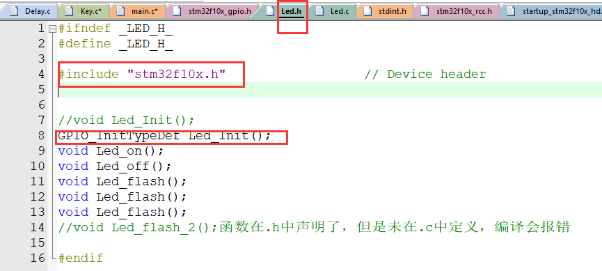

## 1.C语言中 .h文件和.c文件区别

一、意思不同

1. .h中一般放的是同名.c文件中定义的变量、数组、函数的**声明**，需要让.c外部使用的声明。
2. .c文件一般放的是变量、数组、函数的**具体定义**。
3. 独立的项目.c文档中定义，对应的.h文档中声明，最终在main.c文档中调用

二、用法不同

1. .h文件，称为**头文件**，一般存储类型的定义，函数的声明等。通常，头文件被.c文件包含，使用#include 语句。但值得注意的是，这只是一种约定，而非强制。

   

   上图中led.h中需要用到gpio相关的函数，先include "stm32f10x.h",再在led.c中include对应的.h即可

2. .c文件，以c为扩展名，一般**存储具体功能的实现**。

3. main.c中声明所要用到的.h即可，不用再次声明其他.c文件中的函数

## 2.调试方法

